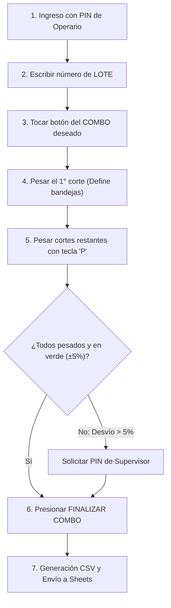

# 🥩 MANUAL DE CAPACITACIÓN OPERATIVA
## Módulo de Armado y Control de Combos Cárnicos (SPI Despiece)

---

### 🎯 1. OBJETIVO DE LA INTEGRACIÓN DE COMBOS

El nuevo módulo de **Combos** en el sistema SPI Despiece fue diseñado para:
1. **Estandarizar las recetas oficiales**: Garantizar que cada combo que sale al mostrador respete exactamente la fórmula aprobada por la empresa.
2. **Control estricto de mermas y costos**: Evitar excesos o faltantes de carne en las bandejas mediante un control de tolerancia en tiempo real.
3. **Control exacto de inventario**: Dar de baja los kilos de cortes utilizados y dar de alta automáticamente la cantidad de bandejas del combo en el sistema central de stock (AppSheet / Google Sheets).

---

### 📋 2. CATÁLOGO OFICIAL DE LAS 7 RECETAS

Cada combo cuenta con un código oficial ERP y una receta exacta de cortes e ingredientes:

| # | Combo Oficial | Cód. ERP | Peso Nominal | Receta de Ingredientes por Bandeja |
|---|---|:---:|:---:|---|
| **1** | **Asado (3 kg)** | `01030002` | **3.00 kg** | • Tapa de asado: **1.10 kg**<br>• Costeleta al través: **0.50 kg**<br>• Costilla - Pechito: **0.89 kg**<br>• Chorizo de cerdo: **0.29 kg**<br>• Morcilla bombón: **0.23 kg** |
| **2** | **Asado Premium (4 kg)** | `01030003` | **4.00 kg** | • Matambre de cerdo: **0.90 kg**<br>• Tapa de asado: **1.10 kg**<br>• Costilla - Pechito: **1.00 kg**<br>• Costeleta al través: **0.45 kg**<br>• Chorizo de cerdo: **0.35 kg**<br>• Morcilla bombón: **0.20 kg** |
| **3** | **Oferta Asado 2 (2.5 kg)** | `01030039` | **2.50 kg** | • Chuleta de paleta: **2.00 kg**<br>• Chorizo de cerdo: **0.50 kg** |
| **4** | **Oferta Asado 2Kg. (2 kg)** | `01030038` | **2.00 kg** | • Costilla - Pechito: **1.50 kg**<br>• Chorizo de cerdo: **0.50 kg** |
| **5** | **Combo Semanal (4 kg)** | `01030021` | **4.00 kg** | • Milanesa de cerdo: **0.70 kg**<br>• Costeleta: **0.70 kg**<br>• Picada especial: **1.00 kg**<br>• Chuleta con cuero: **1.605 kg** |
| **6** | **Combo Locro (3 kg)** | `01030020` | **3.00 kg** | • Chuleta de paleta: **1.00 kg**<br>• Caracú: **1.00 kg**<br>• Chorizo de cerdo: **1.00 kg** |
| **7** | **Locro Premium (3.5 kg)** | `01030086` | **3.50 kg** | • Chuleta de paleta: **1.50 kg**<br>• Caracú: **1.00 kg**<br>• Chorizo de cerdo: **0.50 kg**<br>• Panceta: **0.50 kg** |

---

### 🧠 3. REGLAS FUNDAMENTALES QUE EL OPERARIO DEBE CONOCER

#### Regla A: Las bandejas SIEMPRE son números redondos (enteros)
- No existen medias bandejas (0.5) ni números fraccionarios.
- El peso teórico de cada ingrediente siempre será un **múltiplo exacto** de la fórmula unitaria por la cantidad de bandejas totales.
- *Ejemplo*: Si se van a armar **40 bandejas** de Asado Premium x 4 kg:
  - Tapa de asado: 40 x 1.10 kg = **44.00 kg**
  - Matambre: 40 x 0.90 kg = **36.00 kg**
  - Costilla: 40 x 1.00 kg = **40.00 kg**

#### Regla B: El primer corte pesado define el "Pivote"
- Al pesar el primer ingrediente en la balanza, el sistema calcula de forma automática cuántas bandejas redondas se van a elaborar según los kilos colocados en la balanza.
- Si necesitás forzar una cantidad exacta de bandejas (por ejemplo, el encargado pide armar exactamente 30 bandejas), podés usar el botón **`[ ✏️ MODIFICAR BANDEJAS ]`** en cualquier momento.

#### Regla C: Control estricto de tolerancia (±5%)
- El sistema evalúa el pesaje de cada corte contra el peso teórico esperado.
- **🟢 VERDE (Conforme)**: El pesaje está dentro del rango aceptable (desvío de entre -5% y +5%).
- **🟠/🔴 NARANJA O ROJO (Fuera de tolerancia)**: El corte tiene más del 5% de diferencia (sobra o falta carne). El sistema mostrará un banner de alerta con los kilos exactos de desvío.

#### Regla D: No se puede finalizar si faltan cortes
- Para cerrar un combo es **obligatorio** haber registrado el peso de **todos y cada uno** de los ingredientes que componen la receta.
- Si falta alguno, el sistema lo bloqueará indicando el nombre del corte faltante.

---

### 🚀 4. PASO A PASO OPERATIVO EN PANTALLA



#### Paso 1: Identificación y Lote
1. En la pantalla inicial, ingresá tu PIN de 6 dígitos con el teclado en pantalla.
2. En el casillero **Lote**, ingresá el número de lote de la materia prima (podés presionar **`[ ⌨️ INGRESAR LOTE ]`** para usar el teclado grande táctil).
   > [!IMPORTANT]
   > No se puede iniciar ningún combo sin haber cargado el número de lote.

#### Paso 2: Seleccionar el Combo a Preparar
- En la parte inferior de la pantalla inicial verás los botones violetas de los combos:
  - `[ 1. ASADO (3 KG) ]`
  - `[ 2. ASADO PREMIUM (4 KG) ]`
  - `[ 3. OFERTA ASADO 2 (2.5 KG) ]`
  - etc.
- Al tocar el combo elegido, el sistema abrirá la **Pantalla de Armado de Combo**.

#### Paso 3: Pesar los Ingredientes
1. Arriba a la derecha verás las **Bandejas Estimadas**.
2. En la botonera superior, los cortes aparecerán en color azul: `[PENDIENTE]`.
3. Colocá el corte sobre la balanza.
4. Presioná la tecla **`P`** del teclado físico o tocá el botón verde grande en pantalla:
   **`[ ⚖️ REGISTRAR PESO ACTUAL ('P') ]`**.
5. Ni bien registrás el primer corte:
   - El sistema calcula cuántas bandejas enteras corresponden a ese peso.
   - La tabla muestra el **Peso Real**, **Peso Teórico**, el **Desvío %** y el estado `✅ CONFORME`.
   - El botón del corte pasa a color **VERDE**.
   - El sistema selecciona automáticamente el siguiente corte pendiente para agilizar el trabajo.

#### Paso 4: Ajustes o Correcciones sobre la marcha
- **Si pusiste mal un corte en la balanza**:
  1. Tocá el corte en la botonera superior.
  2. Presioná **`[ 🗑️ RE-PESAR ]`**.
  3. El sistema te preguntará si querés borrar el peso previo. Confirmá con "Sí" y pesalo de nuevo.
- **Si querés fijar una cantidad exacta de bandejas**:
  1. Tocá el botón **`[ ✏️ MODIFICAR BANDEJAS ]`** arriba a la derecha.
  2. Escribí el número redondo (ej: `25`, `50`).
  3. Todos los pesos teóricos se recalcularán automáticamente a esa cantidad.
- **Si la balanza no tiene señal o estás en contingencia**:
  1. Podés usar el botón **`[ ⌨️ PESO MANUAL ]`** para ingresar los kilos a mano (si está habilitado con PIN de administración).

#### Paso 5: Finalizar el Combo
1. Cuando hayas pesado todos los ingredientes, presioná el botón azul **`[ 🔒 FINALIZAR COMBO ]`**.
2. **Caso 1 - Todo dentro de tolerancia (±5%)**:
   - El sistema guardará el combo inmediatamente.
   - Verás el mensaje: *"¡Proceso de Combo guardado con éxito! Total bandejas: XX"*.
   - El stock se descuenta y se envía en tiempo real a Google Sheets / AppSheet.
3. **Caso 2 - Algún corte se desvió más del ±5%**:
   - El sistema mostrará un cartel avisando el desvío exacto:
     *(Ejemplo: "• Tapa de asado: Sobran 3.20 kg (+7.3%)")*.
   - Preguntará si querés solicitar la **Autorización del Supervisor**.
   - Si se confirma, el supervisor deberá ingresar su **PIN de Supervisor** en la pantalla flotante para aprobar la excepción.
   - Quedará registrado en el reporte como `[AUTORIZADO POR SUPERVISOR]`.

---

### ❓ 5. PREGUNTAS FRECUENTES (FAQ)

**P: ¿Qué pasa si intento finalizar y me olvidé de pesar un corte?**  
*R:* El sistema no te dejará cerrar el combo y te mostrará un cartel rojo con la lista de los ingredientes que faltan pesar.

**P: ¿Qué pasa si corté carne de más y supera el 5% de tolerancia?**  
*R:* Tenés dos alternativas:
1. Retirar el exceso de carne y tocar **`[ 🗑️ RE-PESAR ]`** para que quede en verde.
2. Si la tanda debe salir así por una razón justificada de producción, llamar al supervisor para que ingrese su PIN de autorización.

**P: ¿Qué ocurre si se corta internet mientras estoy trabajando?**  
*R:* El sistema sigue funcionando con total normalidad. El pesaje y el combo se guardan de forma segura en la base de datos de la computadora local y, apenas vuelva la conexión, se sincroniza solo con la nube.

**P: ¿Cómo cancelo una tanda de combos si me equivoqué de receta?**  
*R:* Presioná el botón rojo **`[ ❌ CANCELAR ]`** abajo a la izquierda. El sistema te pedirá confirmación y volverá a la pantalla principal sin alterar el stock.

---

### 📌 6. RESUMEN RÁPIDO PARA PEGAR EN EL SECTOR DE PESAJE

```text
┌─────────────────────────────────────────────────────────────┐
│             GUÍA RÁPIDA - ARMADO DE COMBOS                  │
├─────────────────────────────────────────────────────────────┤
│ 1. INGRESAR PIN Y NÚMERO DE LOTE.                           │
│ 2. ELEGIR EL COMBO (Botones violetas).                      │
│ 3. PESAR CADA CORTE Y APRETAR LA TECLA 'P'.                 │
│ 4. VERIFICAR QUE TODOS LOS CORTES QUEDEN EN VERDE (±5%).    │
│ 5. RE-PESAR CON [ 🗑️ RE-PESAR ] SI HUBO ERROR DE CARGA.     │
│ 6. APRETAR [ 🔒 FINALIZAR COMBO ] AL TERMINAR TODOS.        │
│ 7. SI HAY ALERTA NARANJA, LLAMAR AL SUPERVISOR.             │
└─────────────────────────────────────────────────────────────┘
```
