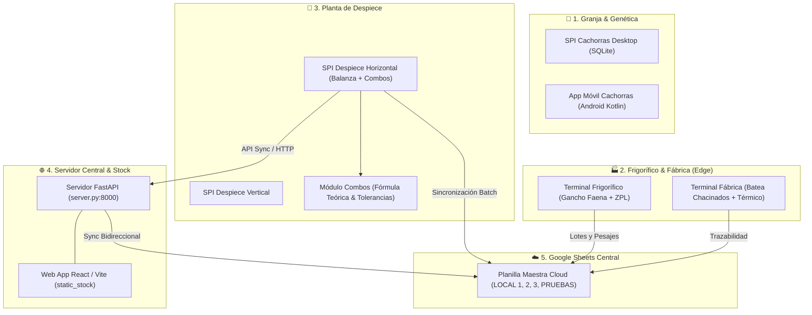

# 🗺️ MAPA MAESTRO DEL SISTEMA DE PRODUCCIÓN INTEGRAL (SPI)

Bienvenido a la guía integral de arquitectura, componentes y ejecución del **Sistema de Producción Integral (SPI)**. Este documento resume el propósito de cada módulo, cómo iniciar cada aplicación, la estructura del proyecto y los protocolos de integración.

---

## 🚀 Acceso Rápido: Lanzadores con 1 Solo Clic

Para facilitar la operación diaria del personal de planta, supervisores y desarrolladores, la raíz del proyecto cuenta con los siguientes ejecutables directos (`.bat`):

| Acceso Directo | Módulo | Propósito | Tecnología Principal |
| :--- | :--- | :--- | :--- |
| **`LANZADOR_SPI.bat`** | **Panel Maestro de Control** | **Interfaz gráfica unificada para lanzar cualquier módulo, ver estado de salud del sistema, abrir carpetas y Google Sheets.** | CustomTkinter (Dark Mode) |
| `01_SPI_Despiece_Horizontal.bat` | SPI Despiece (Horizontal) | Interfaz de pantalla ancha optimizada para balanza serial en planta y pesado de bandejas/combos. | Python / CustomTkinter / PySerial |
| `02_SPI_Despiece_Vertical.bat` | SPI Despiece (Vertical) | Interfaz compacta vertical para terminales táctiles tradicionales. | Python / CustomTkinter |
| `03_Servidor_Web_y_Stock.bat` | Servidor Central & Stock | Inicia el backend API REST y abre automáticamente la Web App de control de stock (`http://localhost:8000`). | FastAPI / Uvicorn / React Vite |
| `04_SPI_Cachorras.bat` | SPI Cachorras (Granja) | Software de escritorio para control de granja porcina, partos, inseminación y trazabilidad. | Python / CustomTkinter / SQLite |
| `05_SPI_Frigorifico_Faena.bat` | Terminal Frigorífico | Terminal táctil industrial de faena: pesaje al gancho aéreo y generación de etiquetas Zebra ZPL. | Python Edge / CustomTkinter / ZPL |
| `06_SPI_Fabrica_Despiece.bat` | Terminal Fábrica | Terminal de chacinados: pesaje de batea, semáforo térmico (< 4°C) y gestión de lotes fijos. | Python Edge / CustomTkinter |
| `07_Diagnostico_Balanza.bat` | Diagnóstico de Balanza | Herramienta técnica para probar lectura continua y manual de balanzas Systel (puertos COM). | Python / PySerial / CustomTkinter |
| `08_Ejecutar_Tests_Sistema.bat` | Suite de Pruebas Unitarias | Ejecuta las pruebas automatizadas de combos, fórmulas de bandejas, validación y sincronización. | Python `unittest` |

---

## 🏛️ Arquitectura de los 5 Subsistemas



---

## 📁 Estructura del Repositorio

```
Sistema de Producción Integral/
│
├── 🚀 LANZADORES (.bat)
│   ├── LANZADOR_SPI.bat                 # Panel maestro visual interactivo
│   ├── 01_SPI_Despiece_Horizontal.bat   # Despiece horizontal (recomendado)
│   ├── 02_SPI_Despiece_Vertical.bat     # Despiece vertical
│   ├── 03_Servidor_Web_y_Stock.bat      # Servidor FastAPI y Web App
│   ├── 04_SPI_Cachorras.bat             # Sistema de granja
│   ├── 05_SPI_Frigorifico_Faena.bat     # Terminal de gancho faena
│   ├── 06_SPI_Fabrica_Despiece.bat      # Terminal batea chacinados
│   ├── 07_Diagnostico_Balanza.bat       # Test serial de balanza
│   └── 08_Ejecutar_Tests_Sistema.bat    # Suite de pruebas unitarias
│
├── 🧠 MÓDULOS NUCLEO (PYTHON EN RAÍZ)
│   ├── panel_control.py                 # Código del Panel Maestro de Control
│   ├── main_horizontal.py               # GUI principal horizontal de Despiece
│   ├── main.py                          # GUI principal vertical de Despiece
│   ├── combos_config.py                 # Catálogo de 7 combos, fórmulas teóricas y tolerancias (+/-5%)
│   ├── procesador_datos.py              # Validación de pesadas, auditoría y guardado de CSVs
│   ├── auth_sync.py                     # Sincronización Google Sheets con OAuth / Service Account
│   ├── server.py                        # Backend central FastAPI + WebSockets + Stock
│   ├── test_serial_gui.py               # GUI de diagnóstico para balanza Systel
│   ├── updater.py                       # Gestor de actualizaciones remotas
│   └── screen_streamer.py               # Streaming de pantalla en tiempo real
│
├── 📊 ARCHIVOS DE DATOS Y CONFIGURACIÓN CRÍTICOS (¡NO MOVER!)
│   ├── CODIGOS.csv                      # Maestro de códigos oficiales (Combos, Cortes y Menudencias)
│   ├── cortes_madre_y_resultantes.csv   # Relación entre cortes primarios y secundarios
│   ├── credentials.json                 # Credenciales de Google Cloud API
│   ├── token.json                       # Token de sesión OAuth activo
│   ├── config.json                      # Configuración de sucursal / local
│   ├── updates_config.json              # Configuración de URLs de actualización
│   └── requirements.txt                 # Librerías de Python requeridas
│
├── 📁 SUB-APLICACIONES
│   ├── SPI - Cachorras/                 # Sistema de cría de cachorras (Desktop Python + SQLite)
│   ├── SPI NEW/Frigorifico-Fabrica/     # Terminales de Faena y Chacinados (python_edge)
│   ├── SPI - Movil/                     # App móvil de distribución (Android Studio / Kotlin)
│   ├── SPI Cachorras Movil/             # App móvil de granja (Android Studio / Kotlin)
│   ├── stock-app/                       # Código fuente frontend React + Vite + Tailwind
│   └── static_stock/                    # Build compilado del frontend servido por FastAPI
│
├── 📁 CARPETAS ORGANIZADAS DE SOPORTE
│   ├── Informes/                        # Documentos técnicos, guías y recursos de hardware
│   │   └── recursos_hardware/           # Fotografías y especificaciones de balanzas
│   ├── Muestras_CSVs_Historicos/        # CSVs de prueba y registros históricos de pesajes
│   └── tests/                           # Suite de pruebas automatizadas (unittest)
│       ├── test_combos_despiece.py      # Validación de combos y bandejas
│       └── test_local_pruebas.py        # Validación de destino Local Pruebas y códigos
```

---

## 🥩 Reglas Operativas de Combos en Despiece

En la ventana de **Despiece**, el operador puede armar bandejas de combos con las siguientes reglas estandarizadas:

1. **Bandejas Redondas**:
   - Al ingresar el peso del primer corte, el sistema calcula el número **entero** de bandejas que pueden armarse:
     $$\text{Bandejas Teóricas} = \operatorname{round}\left(\frac{\text{Peso Real Ingresado}}{\text{Gramaje Teórico Unitario}}\right)$$
   - Con ese número entero de bandejas, se recalculan los pesos teóricos requeridos para los cortes restantes:
     $$\text{Peso Teórico Corte } i = \text{Bandejas} \times \text{Gramaje Teórico Unitario}_i$$
2. **Control de Tolerancia**:
   - Tolerancia estándar permitida: **$\pm 5.0\%$**.
   - Si la desviación de un corte o del total supera el $5\%$, el sistema alerta con color naranja/rojo y requiere clave de supervisor.
3. **Catálogo Oficial de 7 Combos**:
   - `00041`: COMBO ASADO x 3 KG (Tapa de asado 1.10 kg, Costeleta al través 0.50 kg, Costilla 0.89 kg, Chorizo cerdo 0.29 kg, Morcilla bombón 0.23 kg).
   - `00042`: COMBO ASADO PREMIUM x 4 KG (Matambre 0.90 kg, Tapa de asado 1.10 kg, Costilla 1.00 kg, Costeleta 0.45 kg, Chorizo 0.35 kg, Morcilla 0.20 kg).
   - `00043`: COMBO ASADO ECONOMICO x 2.5 KG (Chuleta de paleta 2.00 kg, Chorizo de cerdo 0.50 kg).
   - `00044`: COMBO ASADO x 2 KG (Costilla 0.90 kg, Falda 0.60 kg, Chorizo 0.30 kg, Morcilla 0.20 kg).
   - `00045`: COMBO LOCRO x 3 KG (Chuleta de paleta 1.00 kg, Caracú 1.00 kg, Chorizo de cerdo 1.00 kg).
   - `00046`: COMBO LOCRO PREMIUM x 3.5 KG (Chuleta de paleta 1.50 kg, Caracú 1.00 kg, Chorizo de cerdo 0.50 kg, Panceta salada 0.50 kg).
   - `00047`: COMBO SEMANAL x 4 KG (Milanesa 0.70 kg, Costeletas 0.70 kg, Picada común 1.00 kg, Chuleta con cuero 1.605 kg).

---

## ☁️ Google Sheets & Locales

- **ID de la Planilla Central**: `1YYjZD_0lUIljt4fSCAgYF_hkYT3cyN4NRAXKUTulQwY`
- **Pestañas soportadas**:
  - `LOCAL 1`
  - `LOCAL 2`
  - `LOCAL 3`
  - `LOCAL PRUEBAS` (Utilizada para ensayos de auditoría y pruebas sin afectar inventario real).

---

## 🛠️ Comandos de Mantenimiento

- **Ejecutar Suite de Tests**:
  ```bash
  python -m unittest discover tests -v
  ```
- **Iniciar Servidor Web de Stock**:
  ```bash
  python server.py
  ```
- **Compilar Ejecutable PyInstaller (Despiece Horizontal)**:
  ```bash
  pyinstaller "SPI - Despiece Horizontal.spec"
  ```
