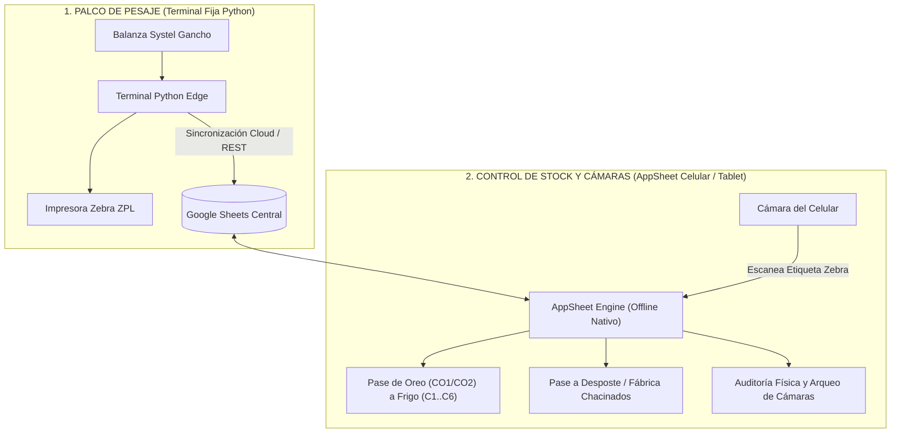

# GUÍA TÉCNICA DE IMPLEMENTACIÓN: MÓDULO DE STOCK EN GOOGLE APPSHEET
**Sistema de Producción Integral (SPI) - Frigorífico, Cámaras y Fábrica**  
*Versión: 2.0 Industrial | Fecha: Septiembre 2026*

---

## 1. Arquitectura y Principio de Funcionamiento

El módulo de control de stock está diseñado bajo el principio de **Arquitectura Híbrida SPI**:
1. **Palco de Faena y Básculas (Python Edge):** Conexión directa a puertos serie RS-232 (balanza Systel de gancho y balanza Moretti de batea) para pesaje ultrarrápido ($<50\text{ ms}$) e impresión de etiquetas Zebra ZPL con códigos de barras. Escribe los registros en el buffer local y los sincroniza a Google Sheets.
2. **Control de Stock, Cámaras y Auditorías (Google AppSheet):** Aplicación móvil/tablet utilizada por el encargado de cámaras, capataz y supervisores mientras recorren las cámaras frigoríficas (`CO1`, `CO2`, `C1` a `C6`) y la fábrica.
   - **100% Offline-First:** Funciona sin señal dentro de las cámaras frigoríficas (paneles térmicos de poliuretano que bloquean WiFi/4G). Sincroniza al salir al pasillo o antecámara.
   - **Escáner de Código de Barras / QR:** Utiliza la propia cámara del celular para leer las etiquetas adhesivas Zebra pegadas en las canales.
   - **Auditoría y Arqueo Ciego:** Compara el stock teórico del sistema contra el conteo físico en gancheras y calcula diferencias ($\Delta$).

---

## 2. Paso a Paso: Puesta en Marcha en Google Drive y AppSheet

### Paso 1: Subir la planilla a Google Drive
1. En tu Google Drive, crea una carpeta llamada `SPI_Produccion`.
2. Sube el archivo generado: [`SPI_Control_Stock_AppSheet.xlsx`](file:///c:/Users/matsa/OneDrive/Escritorio/Sistema%20de%20Producci%C3%B3n%20Integral/SPI%20NEW/Frigorifico-Fabrica/appsheet_stock/SPI_Control_Stock_AppSheet.xlsx).
3. Haz doble clic en el archivo subido y selecciona **Abrir con Hojas de cálculo de Google**.
4. En el menú superior de Google Sheets, ve a **Archivo > Guardar como hoja de cálculo de Google**.

### Paso 2: Crear la Aplicación en AppSheet
1. Ingresa a [https://www.appsheet.com](https://www.appsheet.com) con tu cuenta de Google.
2. Haz clic en **Create > App > Start with existing data**.
3. Nombra la aplicación: `SPI - Control de Stock y Cámaras`.
4. En la categoría, selecciona `Logistics & Inventory`.
5. Selecciona la hoja de cálculo de Google que acabas de guardar.
6. AppSheet cargará automáticamente la primera tabla (`Camaras_Depositos`).

---

## 3. Configuración de Tablas y Columnas en AppSheet

Dentro del panel de AppSheet (**Data > Tables**), agrega las siguientes hojas del documento:
1. `Camaras_Depositos`
2. `Stock_Medias_Reses`
3. `Movimientos_Kardex`
4. `Auditorias_Stock`
5. `Parametros_Validacion`

### A. Tabla: `Camaras_Depositos` (Maestro de Ubicaciones Físicas)
Configura las columnas en **Data > Columns > Camaras_Depositos**:

| Columna | Tipo de Dato | Key | Label | Configuración / Fórmula AppSheet |
| :--- | :---: | :---: | :---: | :--- |
| `ID_Camara` | **Text** | ✅ | ❌ | Códigos cortos (`CO1`, `CO2`, `C1` a `C6`, etc.) |
| `Nombre_Camara` | **Text** | ❌ | ✅ | Nombre legible para el usuario |
| `Tipo_Deposito` | **Enum** | ❌ | ❌ | Valores: `OREO_FAENA`, `CONSERVACION`, `PROCESO_PRODUCTIVO`, `LOGISTICA` |
| `Capacidad_Maxima_MR` | **Number** | ❌ | ❌ | Capacidad en medias reses ($400$ en Oreo, $700$ en Frigoríficas) |
| `Temperatura_Objetivo_C` | **Decimal** | ❌ | ❌ | $2.0\text{ °C}$ en Oreo, $0.0\text{ °C}$ en Frío |
| `Stock_Actual_MR` | **Number** | ❌ | ❌ | **AppSheet Formula:** `COUNT(SELECT(Stock_Medias_Reses[ID_Media_Res], [Ubicacion_Actual] = [_THISROW].[ID_Camara]))` |
| `Kilos_Totales_Actuales` | **Decimal** | ❌ | ❌ | **AppSheet Formula:** `SUM(SELECT(Stock_Medias_Reses[Peso_Caliente_Kg], [Ubicacion_Actual] = [_THISROW].[ID_Camara]))` |
| `Porcentaje_Ocupacion` | **Percent** | ❌ | ❌ | **AppSheet Formula:** `IF([Capacidad_Maxima_MR] > 0, [Stock_Actual_MR] / [Capacidad_Maxima_MR], 0)` |
| `Estado_Ocupacion` | **Enum** | ❌ | ❌ | **AppSheet Formula:** `IFS([Porcentaje_Ocupacion] >= 0.95, "SATURADA", [Porcentaje_Ocupacion] >= 0.80, "ALERTA", TRUE, "NORMAL")` |

---

### B. Tabla: `Stock_Medias_Reses` (Inventario Unitario de Canales)
Configura las columnas en **Data > Columns > Stock_Medias_Reses**:

| Columna | Tipo de Dato | Key | Label | Configuración / Fórmula AppSheet |
| :--- | :---: | :---: | :---: | :--- |
| `ID_Media_Res` | **Text** | ✅ | ✅ | **Scannable:** `TRUE` (habilita lector de código de barras con la cámara). Ej: `MR-IZQ-00412-01` |
| `Numero_Animal` | **Number** | ❌ | ❌ | N° de Cerdo correlativo en la tropa |
| `Lado` | **Enum** | ❌ | ❌ | Valores: `IZQ`, `DER` |
| `Tropa` | **Text** | ❌ | ❌ | Ej: `TRP-2026-00412` |
| `Ubicacion_Actual` | **Ref** | ❌ | ❌ | **Source Table:** `Camaras_Depositos` |
| `Tipo_Animal` | **Enum** | ❌ | ❌ | Valores: `MEI`, `CAP`, `SAN`, `CER`, `CACH`, `LECH` |
| `Fecha_Faena` | **Date** | ❌ | ❌ | Initial Value: `TODAY()` |
| `Peso_Caliente_Kg` | **Decimal** | ❌ | ❌ | Peso registrado en balanza de gancho caliente |
| `Peso_Frio_Kg` | **Decimal** | ❌ | ❌ | Peso registrado al salir de la cámara de oreado (opcional) |
| `Merma_Oreo_Kg` | **Decimal** | ❌ | ❌ | **AppSheet Formula:** `IF(ISNOTBLANK([Peso_Frio_Kg]), [Peso_Caliente_Kg] - [Peso_Frio_Kg], 0)` |
| `Merma_Oreo_Pct` | **Percent** | ❌ | ❌ | **AppSheet Formula:** `IF([Peso_Caliente_Kg] > 0, [Merma_Oreo_Kg] / [Peso_Caliente_Kg], 0)` |
| `Estado_Sanitario` | **Enum** | ❌ | ❌ | Valores: `APTA`, `DECOMISO_PARCIAL`, `DECOMISO_TOTAL` |
| `Decomiso_Parcial_Motivo` | **Enum** | ❌ | ❌ | Valores: `CO`, `CA`, `AB`, `HE` |
| `Decomiso_Parcial_Kilos` | **Decimal** | ❌ | ❌ | Kilos descontados por desbaste veterinario |
| `Kilos_Netos_Aptos` | **Decimal** | ❌ | ❌ | **AppSheet Formula:** `[Peso_Caliente_Kg] - [Decomiso_Parcial_Kilos]` |
| `Estado_Ciclo` | **Enum** | ❌ | ❌ | `EN_OREO`, `EN_CAMARA_FRIGO`, `EN_DESOSTE`, `DESPACHADA`, `DECOMISADA` |
| `Captura_Manual` | **Enum** | ❌ | ❌ | `SI`, `NO` (alerta si se cargó por balanza rota) |
| `Autorizado_Por` | **Text** | ❌ | ❌ | Supervisor o Administrador que autorizó contingencia manual |
| `Fecha_Ultimo_Movimiento` | **ChangeTimestamp**| ❌ | ❌ | Se actualiza automáticamente en cada cambio de ubicación |

---

### C. Tabla: `Movimientos_Kardex` (Historial Inmutable de Trazabilidad)
Configura las columnas en **Data > Columns > Movimientos_Kardex**:

| Columna | Tipo de Dato | Key | Label | Configuración / Fórmula AppSheet |
| :--- | :---: | :---: | :---: | :--- |
| `ID_Movimiento` | **Text** | ✅ | ❌ | **Initial value:** `UNIQUEID()` |
| `Fecha_Hora` | **DateTime** | ❌ | ❌ | **Initial value:** `NOW()` |
| `ID_Media_Res` | **Ref** | ❌ | ✅ | **Source Table:** `Stock_Medias_Reses` (Scannable = TRUE) |
| `Tipo_Movimiento` | **Enum** | ❌ | ❌ | `1. INGRESO_FAENA`, `2. PASE_OREO_A_FRIGO`, `3. TRANSFERENCIA_INTERNA`, `4. PASE_A_FABRICA`, `5. DESPACHO_REMITO`, `6. AJUSTE_AUDITORIA` |
| `Camara_Origen` | **Ref** | ❌ | ❌ | **Source Table:** `Camaras_Depositos` |
| `Camara_Destino` | **Ref** | ❌ | ❌ | **Source Table:** `Camaras_Depositos` |
| `Kilos_Movidos` | **Decimal** | ❌ | ❌ | **Initial value:** `[ID_Media_Res].[Peso_Caliente_Kg]` |
| `Operario_Responsable` | **Text** | ❌ | ❌ | Nombre del operario o supervisor activo |
| `Motivo_Observacion` | **LongText** | ❌ | ❌ | Observaciones bromatológicas o logísticas |

> [!IMPORTANT]
> **Seguridad de Auditoría:** En los permisos de la tabla `Movimientos_Kardex`, activa únicamente **Adds** (desactiva **Updates** y **Deletes**). Esto garantiza que ningún operario pueda borrar ni alterar un movimiento registrado.

---

### D. Tabla: `Auditorias_Stock` (Arqueo Físico vs. Teórico)
Configura las columnas en **Data > Columns > Auditorias_Stock**:

| Columna | Tipo de Dato | Key | Label | Configuración / Fórmula AppSheet |
| :--- | :---: | :---: | :---: | :--- |
| `ID_Auditoria` | **Text** | ✅ | ❌ | **Initial value:** `UNIQUEID()` |
| `Fecha_Auditoria` | **Date** | ❌ | ❌ | **Initial value:** `TODAY()` |
| `Hora_Auditoria` | **Time** | ❌ | ❌ | **Initial value:** `TIMENOW()` |
| `Camara_Auditada` | **Ref** | ❌ | ✅ | **Source Table:** `Camaras_Depositos` |
| `Auditor_Nombre` | **Text** | ❌ | ❌ | Nombre o Legajo del auditor |
| `Stock_Teorico_MR` | **Number** | ❌ | ❌ | **AppSheet Formula:** `[Camara_Auditada].[Stock_Actual_MR]` |
| `Stock_Fisico_Contado` | **Number** | ❌ | ❌ | Conteo manual que el auditor digita |
| `Diferencia_MR` | **Number** | ❌ | ❌ | **AppSheet Formula:** `[Stock_Fisico_Contado] - [Stock_Teorico_MR]` |
| `Resultado_Auditoria` | **Enum** | ❌ | ❌ | **AppSheet Formula:** `IFS([Diferencia_MR] = 0, "EXACTO", [Diferencia_MR] < 0, "FALTANTE", TRUE, "SOBRANTE")` |
| `Nivel_Criticidad` | **Enum** | ❌ | ❌ | **AppSheet Formula:** `IFS(ABS([Diferencia_MR]) = 0, "NORMAL", ABS([Diferencia_MR]) = 1, "ALERTA", TRUE, "GRAVE")` |
| `Motivo_Desvio` | **Enum / Text**| ❌ | ❌ | `Error de conteo`, `Media descolgada`, `Traspaso no asentado`, `Merma excesiva` |
| `Accion_Correctiva` | **Enum** | ❌ | ❌ | `AJUSTAR_STOCK`, `RECONTAR_CAMARA`, `INVESTIGAR_CAMARAS_CONTIGUAS` |
| `Firma_Auditor` | **Signature** | ❌ | ❌ | Captura táctil de firma en la pantalla del celular |

---

## 4. Acciones Táctiles Rápidas en AppSheet (Botones de 1 Toque)

En AppSheet, las **Actions** permiten automatizar tareas operativas complejas en un solo toque:

### Acción 1: "Pase a Cámara Frigorífica" (De Oreo a Conservación)
* **Tabla:** `Stock_Medias_Reses`
* **Do this:** `Data: set the values of some columns in this row`
* **Set columns:**
  * `Ubicacion_Actual` = `"C1"` (o selector de cámara destino `C1`..`C6`)
  * `Estado_Ciclo` = `"EN_CAMARA_FRIGO"`
* **Appearance:** Icono de copo de nieve o termómetro ❄️, Display name: `Mover a Frío`.

### Acción 2: "Transferir a Fábrica de Chacinados / Desposte"
* **Tabla:** `Stock_Medias_Reses`
* **Do this:** `Data: set the values of some columns in this row`
* **Set columns:**
  * `Ubicacion_Actual` = `"FABRICA_DESOSTE"`
  * `Estado_Ciclo` = `"EN_DESOSTE"`
* **Appearance:** Icono de cuchillo o fábrica 🏭, Display name: `Enviar a Fábrica`.

---

## 5. Vistas Recomendadas para la Aplicación Móvil (UX)

Ve a **UX > Views** en AppSheet y configura las 4 pantallas principales:

### Vista 1: "Tablero de Cámaras" (Dashboard Principal)
* **View Type:** `Gallery` o `Deck`
* **For this data:** `Camaras_Depositos`
* **Primary Header:** `[Nombre_Camara]`
* **Secondary Header:** `[Stock_Actual_MR] & " / " & [Capacidad_Maxima_MR] & " MR (" & TEXT([Porcentaje_Ocupacion], "0%") & ")"`
* **Summary Column:** `[Estado_Ocupacion]`
* **Format Rules:**
  * Si `[Porcentaje_Ocupacion] >= 0.95` $\rightarrow$ Color Rojo 🔴 y texto en negrita.
  * Si `[Porcentaje_Ocupacion] >= 0.80` $\rightarrow$ Color Amarillo 🟡.
  * Si `[Porcentaje_Ocupacion] < 0.80` $\rightarrow$ Color Verde 🟢.

### Vista 2: "Escanear Media Res" (Lector de Código de Barras Zebra)
* **View Type:** `Form`
* **For this data:** `Stock_Medias_Reses`
* Permite al operario abrir la cámara, escanear el código de barras `MR-IZQ-00412-01` y ver al instante todo el historial de la pieza con un botón para cambiarla de cámara en 1 segundo.

### Vista 3: "Arqueo y Cierre de Cámara" (Auditoría Diaria)
* **View Type:** `Form`
* **For this data:** `Auditorias_Stock`
* El auditor elige la cámara (`CO1`, `C1`, etc.), la app le muestra cuántas medias reses teóricas hay, ingresa el conteo físico, y si hay diferencia salta la alerta en rojo exigiendo justificación y firma.

### Vista 4: "Historial de Movimientos (Kardex)"
* **View Type:** `Table`
* **For this data:** `Movimientos_Kardex`
* Muestra el registro cronológico ordenado de forma descendente con hora, lote, origen, destino y operario.

---

## 6. Archivos Generados en tu Proyecto

Para tu comodidad, se crearon los siguientes archivos listos para usar en la carpeta:  
📁 `SPI NEW\Frigorifico-Fabrica\appsheet_stock\`

1. **[`SPI_Control_Stock_AppSheet.xlsx`](file:///c:/Users/matsa/OneDrive/Escritorio/Sistema%20de%20Producci%C3%B3n%20Integral/SPI%20NEW/Frigorifico-Fabrica/appsheet_stock/SPI_Control_Stock_AppSheet.xlsx):** Libro de Excel completo con las 5 pestañas, fórmulas preconfiguradas, anchos automáticos y datos semilla de ejemplo.
2. **[`Camaras_Depositos.csv`](file:///c:/Users/matsa/OneDrive/Escritorio/Sistema%20de%20Producci%C3%B3n%20Integral/SPI%20NEW/Frigorifico-Fabrica/appsheet_stock/Camaras_Depositos.csv):** CSV individual de cámaras y capacidades.
3. **[`Stock_Medias_Reses.csv`](file:///c:/Users/matsa/OneDrive/Escritorio/Sistema%20de%20Producci%C3%B3n%20Integral/SPI%20NEW/Frigorifico-Fabrica/appsheet_stock/Stock_Medias_Reses.csv):** CSV individual con el inventario de medias reses y decomisos.
4. **[`Movimientos_Kardex.csv`](file:///c:/Users/matsa/OneDrive/Escritorio/Sistema%20de%20Producci%C3%B3n%20Integral/SPI%20NEW/Frigorifico-Fabrica/appsheet_stock/Movimientos_Kardex.csv):** CSV individual para el historial de transacciones.
5. **[`Auditorias_Stock.csv`](file:///c:/Users/matsa/OneDrive/Escritorio/Sistema%20de%20Producci%C3%B3n%20Integral/SPI%20NEW/Frigorifico-Fabrica/appsheet_stock/Auditorias_Stock.csv):** CSV individual para arqueos de stock y diferencias.
6. **[`Parametros_Validacion.csv`](file:///c:/Users/matsa/OneDrive/Escritorio/Sistema%20de%20Producci%C3%B3n%20Integral/SPI%20NEW/Frigorifico-Fabrica/appsheet_stock/Parametros_Validacion.csv):** CSV individual de catálogos y referencias.
