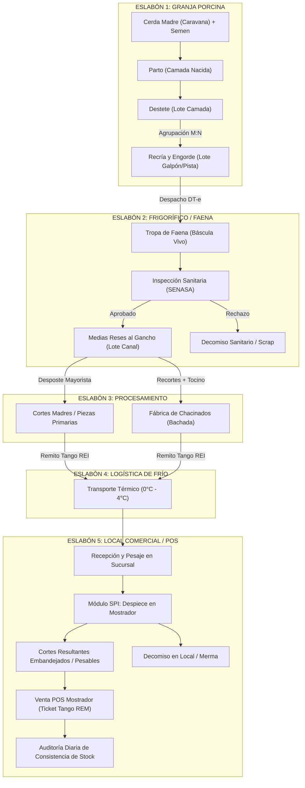
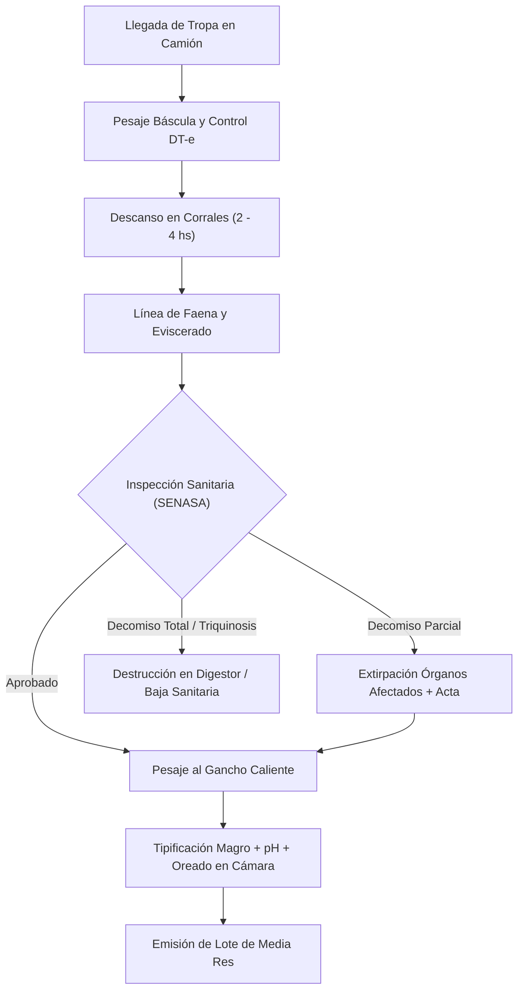
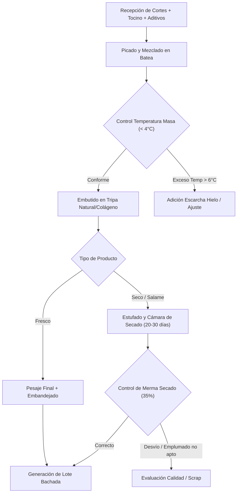
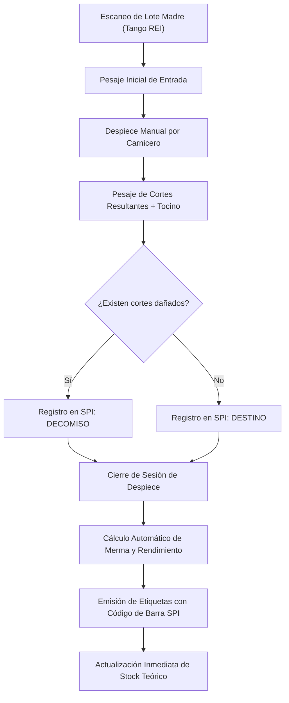
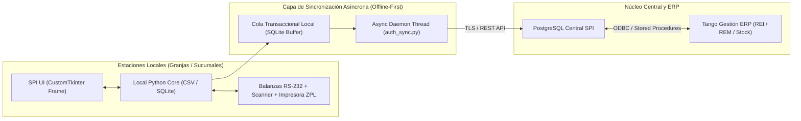

# SISTEMA DE PRODUCCIÓN INTEGRAL (SPI) - PRIMEROS REQUERIMIENTOS (v2.0 Enterprise)
**Especificación Funcional, Flujo de Cadena Productiva, Modelo de Datos Relacional y Arquitectura de Integración**  
*Fecha de Emisión: 2 de Septiembre de 2026*  
*Versión del Documento: 2.0 (Corregida y Auditada)*  
*Estado: Aprobado para Desarrollo y Arquitectura*

---

## 1. INTRODUCCIÓN Y VISIÓN INTEGRAL DE LA CADENA

El **Sistema de Producción Integral (SPI)** es la plataforma core diseñada para unificar, digitalizar, controlar y auditar cada eslabón de la cadena de valor porcina. Abarca desde la inseminación y control genético en granja hasta el fraccionamiento de cortes cárnicos y embutidos en el mostrador del local comercial minorista.

### 1.1 El Hilo Conductor de Trazabilidad M:N (Malla Productiva)
A diferencia de los modelos lineales teóricos, la producción porcina opera como una **red de transformación y agregación de lotes**:
1. Múltiples camadas destetadas componen un lote/galpón de engorde (Muchos a Uno).
2. Tropas de faena generan canales individuales tipificadas (Uno a Muchos).
3. Elaboración de chacinados agrupa recortes de múltiples reses y lotes de materia prima (Muchos a Uno).
4. El despiece en sucursal fracciona un corte madre en cortes finales y subproductos con trazabilidad ascendente (Uno a Muchos).



---

## 2. DATOS PRIMORDIALES E INDICADORES MAESTROS (KPIs)

Todos los indicadores han sido calibrados según estándares zootécnicos internacionales y normativas de la industria cárnica argentina.

| # | Eslabón | KPI Maestro | Fórmula de Cálculo Exacta | Umbral Objetivo | Tolerancia / Alerta |
|---|---------|-------------|---------------------------|-----------------|---------------------|
| 1 | **Reproducción** | **Tasa de Concepción / Preñez (%)** | $\frac{\text{Servicios con Ecografía Positiva}}{\text{Total Servicios Realizados}} \times 100$ | $\ge 88\%$ | Alerta si $< 82\%$ |
| 1 | **Reproducción** | **Días No Productivos (DNP)** | $\text{Fecha Servicio Actual} - \text{Fecha Destete Previo}$ *(o días vacía a descarte)* | $\le 12\text{ días}$ | Alerta si $> 16\text{ días}$ |
| 2 | **Maternidad** | **Mortandad Pre-destete (%)** | $\frac{\text{Lechones Muertos en Lactancia}}{\text{Total Nacidos Vivos}} \times 100$ | $\le 7.5\%$ | Alerta si $> 10.0\%$ |
| 2 | **Maternidad** | **Producción Destete / Cerda / Año** | $(\text{Destetados/Cerda/Año}) \times \text{Peso Promedio al Destete}$ | $\ge 180\text{ kg/año}$ | Alerta si $< 160\text{ kg}$ |
| 3 | **Engorde** | **Conversión Alimenticia (CAF)** | $\frac{\sum \text{Kilos Alimento Balanceado Consumido}}{\sum \text{Kilos Ganancia de Peso Vivo}}$ | $2.20 - 2.50$ | Alerta si $> 2.70$ |
| 3 | **Engorde** | **Ganancia Diaria de Peso (GDP)** | $\frac{\text{Peso Final Vivo (kg)} - \text{Peso Inicial Ingreso (kg)}}{\text{Días de Permanencia en Pista}} \times 1000$ | $\ge 820\text{ g/día}$ | Alerta si $< 750\text{ g/día}$ |
| 3 | **Engorde** | **Mortandad en Engorde (%)** | $\frac{\text{Bajas en Pista}}{\text{Cabezas Ingresadas}} \times 100$ | $\le 2.0\%$ | Alerta si $> 3.5\%$ |
| 4 | **Frigorífico** | **Merma Transporte Pie (%)** | $\frac{\text{Peso Despacho Granja} - \text{Peso Báscula Frigorífico}}{\text{Peso Despacho Granja}} \times 100$ | $\le 1.2\%$ | Alerta si $> 2.0\%$ |
| 4 | **Frigorífico** | **Rendimiento de Faena (%)** | $\frac{\text{Peso Total Medias Reses al Gancho}}{\text{Peso Vivo en Báscula Frigorífico}} \times 100$ | $80.5\% - 82.5\%$ | Alerta si $< 79.5\%$ |
| 4 | **Frigorífico** | **Merma de Cámara / Oreado (%)** | $\frac{\text{Peso Gancho Caliente} - \text{Peso Gancho Frío (24h)}}{\text{Peso Gancho Caliente}} \times 100$ | $\le 1.8\%$ | Alerta si $> 2.4\%$ |
| 5 | **Chacinados** | **Rendimiento Chacinado Fresco (%)** | $\frac{\text{Kilos Chorizo/Salchicha Terminados}}{\text{Kilos Carnes + Grasas Formuladas}} \times 100$ | $99.0\% - 102.0\%$ | Alerta si $< 97\%$ |
| 5 | **Chacinados** | **Rendimiento Chacinado Seco (%)** | $\frac{\text{Kilos Salame/Bondiola Curado}}{\text{Kilos Masa Inicial Embutida}} \times 100$ | $62.0\% - 68.0\%$ | Alerta si $< 58\%$ o $> 72\%$ |
| 6 | **Logística** | **Merma de Transporte Térmico (%)** | $\frac{\text{Kilos Remitidos Planta} - \text{Kilos Recepcionados Local}}{\text{Kilos Remitidos Planta}} \times 100$ | $\le 0.5\%$ | Alerta si $> 1.0\%$ |
| 7 | **Despiece SPI** | **Rendimiento de Despiece (%)** | $\frac{\sum \text{Kilos Cortes Resultantes Útiles}}{\text{Peso Real Corte Madre Ingresado}} \times 100$ | $\ge 93.0\%$ | Alerta si $< 90.0\%$ |
| 8 | **Auditoría POS** | **Desvío de Stock Diario ($\Delta$ kg)** | $\text{Stock Físico en Cámara/Batea} - \text{Stock Teórico Calculado}$ | $\|\Delta\| \le 0.5\text{ kg}$ | Alerta y bloqueo si $> 2.0\text{ kg}$ |

---

## 3. MODELO DE DATOS RELACIONAL POR ESLABÓN (DDL AUDITADO)

El esquema soporta PostgreSQL en el servidor central y se sincroniza con SQLite/CSV local en estaciones *Edge Offline-First*.

### 3.1 Catálogos Maestros y Configuración
```sql
CREATE TABLE catalogo_operarios (
    id_operario BIGSERIAL PRIMARY KEY,
    nombre VARCHAR(100) NOT NULL,
    pin_hash VARCHAR(128) NOT NULL,
    rol VARCHAR(30) NOT NULL CHECK (rol IN ('OPERARIO_GRANJA','CARNICERO','SUPERVISOR','AUDITOR','CHOFER')),
    sucursal_asignada VARCHAR(30),
    activo BOOLEAN DEFAULT TRUE,
    creado_en TIMESTAMP DEFAULT now()
);

CREATE TABLE catalogo_articulos (
    codigo_tango VARCHAR(20) PRIMARY KEY,
    nombre VARCHAR(100) NOT NULL,
    familia VARCHAR(30) NOT NULL CHECK (familia IN ('CORTE_MADRE','CORTE_FINAL','CHACINADO_FRESCO','CHACINADO_SECO','SUBPRODUCTO','INSUMO')),
    unidad VARCHAR(5) NOT NULL DEFAULT 'KG',
    temperatura_conservacion_min NUMERIC(3,1) DEFAULT 0.0,
    temperatura_conservacion_max NUMERIC(3,1) DEFAULT 4.0,
    activo BOOLEAN DEFAULT TRUE
);

CREATE TABLE configuracion_subproductos (
    tipo_subproducto VARCHAR(30) PRIMARY KEY, -- 'TOCINO', 'CUERO', 'HUESO', 'GRASA'
    codigo_articulo_tango VARCHAR(20) NOT NULL REFERENCES catalogo_articulos(codigo_tango),
    lote_fijo_asignado VARCHAR(30) DEFAULT '00049',
    descripcion TEXT
);
```

---

### 3.2 Granja: Reproducción, Partos y Destetes

```sql
CREATE TABLE granja_servicios (
    id_servicio BIGSERIAL PRIMARY KEY,
    id_cerda VARCHAR(20) NOT NULL,
    categoria_cerda VARCHAR(15) NOT NULL CHECK (categoria_cerda IN ('CACHORRA_NULIPARA','MULTIPARA')),
    nro_parto_historico SMALLINT NOT NULL,
    id_macho_dosis VARCHAR(30) NOT NULL,
    fecha_servicio DATE NOT NULL,
    hora_servicio TIME NOT NULL,
    nro_dosis SMALLINT NOT NULL DEFAULT 1 CHECK (nro_dosis BETWEEN 1 AND 3),
    tipo_servicio VARCHAR(15) NOT NULL CHECK (tipo_servicio IN ('INSEMINACION_IA','MONTA_NATURAL')),
    operario_id BIGINT NOT NULL REFERENCES catalogo_operarios(id_operario),
    creado_en TIMESTAMP DEFAULT now()
);

CREATE TABLE granja_diagnostico_prenez (
    id_diagnostico BIGSERIAL PRIMARY KEY,
    id_servicio_fk BIGINT NOT NULL REFERENCES granja_servicios(id_servicio),
    fecha_control DATE NOT NULL,
    metodo VARCHAR(20) NOT NULL DEFAULT 'ECOGRAFIA' CHECK (metodo IN ('ECOGRAFIA','DOPPLER','RETORNO_CELO')),
    resultado VARCHAR(15) NOT NULL CHECK (resultado IN ('POSITIVA','NEGATIVA','DUDOSA')),
    dias_abiertos_calculados SMALLINT,
    fecha_probable_parto DATE,
    creado_en TIMESTAMP DEFAULT now()
);

CREATE TABLE granja_partos (
    id_parto BIGSERIAL PRIMARY KEY,
    id_servicio_fk BIGINT NOT NULL REFERENCES granja_servicios(id_servicio),
    id_cerda VARCHAR(20) NOT NULL,
    fecha_parto DATE NOT NULL,
    sala_maternidad VARCHAR(20) NOT NULL,
    jaula VARCHAR(10) NOT NULL,
    nacidos_vivos SMALLINT NOT NULL,
    nacidos_muertos SMALLINT NOT NULL DEFAULT 0,
    momias SMALLINT NOT NULL DEFAULT 0,
    lechones_adoptados SMALLINT NOT NULL DEFAULT 0, -- Adopción de nodriza (+)
    lechones_donados SMALLINT NOT NULL DEFAULT 0,   -- Cedidos a otra madre (-)
    total_camada_efectiva SMALLINT GENERATED ALWAYS AS (nacidos_vivos + lechones_adoptados - lechones_donados) STORED,
    peso_camada_nacida_kg NUMERIC(6,2) NOT NULL,
    duracion_parto_horas NUMERIC(3,1),
    atencion_parto_operario BIGINT REFERENCES catalogo_operarios(id_operario),
    creado_en TIMESTAMP DEFAULT now()
);

CREATE TABLE granja_destetes (
    id_destete BIGSERIAL PRIMARY KEY,
    id_parto_fk BIGINT NOT NULL REFERENCES granja_partos(id_parto),
    lote_destete_creado VARCHAR(30) UNIQUE NOT NULL,
    fecha_destete DATE NOT NULL,
    dias_lactancia SMALLINT NOT NULL,
    lechones_destetados SMALLINT NOT NULL,
    bajas_en_lactancia SMALLINT NOT NULL DEFAULT 0,
    peso_total_destete_kg NUMERIC(7,2) NOT NULL,
    peso_promedio_lechón_kg NUMERIC(5,2) GENERATED ALWAYS AS (peso_total_destete_kg / NULLIF(lechones_destetados, 0)) STORED,
    destino_cerda VARCHAR(20) NOT NULL CHECK (destino_cerda IN ('RE_SERVICIO','GESTACION_CONFIRMADA','ENFERMERIA','DESCARTE_REFUGO')),
    creado_en TIMESTAMP DEFAULT now()
);
```

---

### 3.3 Granja: Recría, Engorde y Balanceados (Modelo M:N)

```sql
CREATE TABLE granja_lotes_engorde (
    id_lote_engorde VARCHAR(30) PRIMARY KEY,
    galpon_pista VARCHAR(20) NOT NULL,
    fecha_inicio DATE NOT NULL,
    cabezas_ingresadas INTEGER NOT NULL,
    peso_inicial_total_kg NUMERIC(8,2) NOT NULL,
    fecha_cierre DATE,
    cabezas_finales INTEGER,
    peso_final_total_kg NUMERIC(8,2),
    bajas_mortandad INTEGER DEFAULT 0,
    estado VARCHAR(15) DEFAULT 'ACTIVO' CHECK (estado IN ('ACTIVO','DESPACHADO','CERRADO')),
    creado_en TIMESTAMP DEFAULT now()
);

-- Tabla de Composición M:N de Lotes de Engorde (Agrupa múltiples destetes)
CREATE TABLE granja_lote_engorde_composicion (
    id_composicion BIGSERIAL PRIMARY KEY,
    id_lote_engorde_fk VARCHAR(30) NOT NULL REFERENCES granja_lotes_engorde(id_lote_engorde),
    lote_destete_origen_fk VARCHAR(30) NOT NULL REFERENCES granja_destetes(lote_destete_creado),
    cabezas_aportadas INTEGER NOT NULL,
    kilos_aportados NUMERIC(7,2) NOT NULL,
    creado_en TIMESTAMP DEFAULT now()
);

CREATE TABLE granja_consumo_balanceado (
    id_entrega_alimento BIGSERIAL PRIMARY KEY,
    id_lote_engorde_fk VARCHAR(30) NOT NULL REFERENCES granja_lotes_engorde(id_lote_engorde),
    fecha_suministro DATE NOT NULL,
    tipo_formula VARCHAR(30) NOT NULL, -- 'INICIADOR', 'RECRIA', 'DESARROLLO', 'TERMINADOR'
    lote_balanceado_proveedor VARCHAR(30) NOT NULL,
    kilos_alimento_kg NUMERIC(8,2) NOT NULL,
    creado_en TIMESTAMP DEFAULT now()
);
```

---

### 3.4 Frigorífico y Faena

```sql
CREATE TABLE faena_tropas (
    id_tropa_faena VARCHAR(30) PRIMARY KEY,
    id_lote_engorde_fk VARCHAR(30) NOT NULL REFERENCES granja_lotes_engorde(id_lote_engorde),
    dte_senasa VARCHAR(30) NOT NULL UNIQUE,
    fecha_faena DATE NOT NULL,
    hora_inicio_faena TIME NOT NULL,
    cabezas_recibidas INTEGER NOT NULL,
    cabezas_faenadas INTEGER NOT NULL,
    peso_despacho_granja_kg NUMERIC(8,2) NOT NULL,
    peso_vivo_bascula_kg NUMERIC(8,2) NOT NULL,
    decomisos_cabezas_total INTEGER DEFAULT 0,
    merma_transporte_pie_kg NUMERIC(7,2) GENERATED ALWAYS AS (peso_despacho_granja_kg - peso_vivo_bascula_kg) STORED,
    horas_descanso_corral NUMERIC(3,1) NOT NULL,
    creado_en TIMESTAMP DEFAULT now()
);

CREATE TABLE faena_medias_reses (
    id_media_res BIGSERIAL PRIMARY KEY,
    id_tropa_fk VARCHAR(30) NOT NULL REFERENCES faena_tropas(id_tropa_faena),
    lado VARCHAR(3) NOT NULL CHECK (lado IN ('IZQ','DER')),
    peso_gancho_caliente_kg NUMERIC(6,2) NOT NULL,
    peso_gancho_frio_kg NUMERIC(6,2),
    espesor_grasa_dorsal_mm NUMERIC(4,1) NOT NULL,
    porcentaje_magro_estimado NUMERIC(4,1) NOT NULL,
    ph_45min NUMERIC(3,2),
    ph_24h NUMERIC(3,2),
    temperatura_camara_c NUMERIC(3,1) NOT NULL,
    lote_media_res VARCHAR(30) NOT NULL,
    aprobacion_veterinaria_senasa BOOLEAN DEFAULT TRUE,
    creado_en TIMESTAMP DEFAULT now()
);
```

---

### 3.5 Fábrica de Chacinados y Embutidos

```sql
CREATE TABLE catalogo_recetas_chacinados (
    id_receta BIGSERIAL PRIMARY KEY,
    codigo_articulo_tango VARCHAR(20) NOT NULL REFERENCES catalogo_articulos(codigo_tango),
    nombre_receta VARCHAR(100) NOT NULL,
    tipo_proceso VARCHAR(20) NOT NULL CHECK (tipo_proceso IN ('FRESCO','SECO_CURADO','COCIDO')),
    temperatura_mezclado_max NUMERIC(3,1) DEFAULT 4.0,
    rendimiento_teorico_pct NUMERIC(5,2) NOT NULL,
    activo BOOLEAN DEFAULT TRUE
);

CREATE TABLE chacinados_bachadas (
    id_bachada VARCHAR(30) PRIMARY KEY,
    id_receta_fk BIGINT NOT NULL REFERENCES catalogo_recetas_chacinados(id_receta),
    fecha_elaboracion TIMESTAMP NOT NULL,
    operario_responsable BIGINT NOT NULL REFERENCES catalogo_operarios(id_operario),
    temperatura_mezclado_real NUMERIC(3,1) NOT NULL,
    kilos_masa_formulada NUMERIC(8,2) NOT NULL,
    kilos_obtenidos_terminados NUMERIC(8,2) NOT NULL,
    unidades_ristras INTEGER NOT NULL,
    merma_secado_curado_kg NUMERIC(7,2) DEFAULT 0.0,
    creado_en TIMESTAMP DEFAULT now()
);

CREATE TABLE chacinados_ingredientes_consumidos (
    id_ingrediente_item BIGSERIAL PRIMARY KEY,
    id_bachada_fk VARCHAR(30) NOT NULL REFERENCES chacinados_bachadas(id_bachada),
    tipo_ingrediente VARCHAR(30) NOT NULL CHECK (tipo_ingrediente IN ('MAGRO_CERDO','TOCINO_GRASA','CUERO','SANGRE','TRIPA','SAL_CURA_ADITIVO','ESPECIAS')),
    lote_origen_mp VARCHAR(30) NOT NULL, -- Lote de media res o lote de aditivo proveedor
    lote_proveedor_aditivo VARCHAR(30),
    fecha_vencimiento_insumo DATE,
    kilos_utilizados_kg NUMERIC(7,2) NOT NULL,
    creado_en TIMESTAMP DEFAULT now()
);
```

---

### 3.6 Logística de Despacho Térmico

```sql
CREATE TABLE logistica_despachos_remitos (
    id_remito_tango VARCHAR(20) PRIMARY KEY,
    sucursal_destino VARCHAR(30) NOT NULL,
    fecha_salida TIMESTAMP NOT NULL,
    fecha_llegada_real TIMESTAMP,
    chofer_id BIGINT NOT NULL REFERENCES catalogo_operarios(id_operario),
    patente_vehiculo VARCHAR(15) NOT NULL,
    temperatura_caja_salida_c NUMERIC(3,1) NOT NULL,
    temperatura_caja_llegada_c NUMERIC(3,1),
    precinto_seguridad_nro VARCHAR(30) NOT NULL,
    estado VARCHAR(15) DEFAULT 'EN_TRANSITO' CHECK (estado IN ('EN_TRANSITO','RECIBIDO_CONFORME','RECIBIDO_CON_OBSERVACION','RECHAZADO')),
    creado_en TIMESTAMP DEFAULT now()
);

CREATE TABLE logistica_remito_items (
    id_item_remito BIGSERIAL PRIMARY KEY,
    id_remito_fk VARCHAR(20) NOT NULL REFERENCES logistica_despachos_remitos(id_remito_tango),
    codigo_tango VARCHAR(20) NOT NULL REFERENCES catalogo_articulos(codigo_tango),
    lote_origen VARCHAR(30) NOT NULL,
    piezas_unidades INTEGER NOT NULL DEFAULT 1,
    kilos_despachados_kg NUMERIC(8,2) NOT NULL,
    kilos_recibidos_kg NUMERIC(8,2),
    diferencia_merma_transporte_kg NUMERIC(6,2) GENERATED ALWAYS AS (kilos_despachados_kg - kilos_recibidos_kg) STORED,
    creado_en TIMESTAMP DEFAULT now()
);
```

---

### 3.7 Local Comercial: Despiece SPI en Mostrador

```sql
CREATE TABLE spi_despiece_sesiones (
    id_sesion_despiece BIGSERIAL PRIMARY KEY,
    sucursal VARCHAR(30) NOT NULL,
    fecha_hora TIMESTAMP NOT NULL DEFAULT now(),
    operario_id BIGINT NOT NULL REFERENCES catalogo_operarios(id_operario),
    lote_madre VARCHAR(30) NOT NULL,
    codigo_madre VARCHAR(20) NOT NULL REFERENCES catalogo_articulos(codigo_tango),
    corte_madre_nombre VARCHAR(50) NOT NULL,
    peso_madre_ingreso_kg NUMERIC(7,2) NOT NULL,
    peso_total_resultantes_kg NUMERIC(7,2) DEFAULT 0.0,
    peso_merma_despiece_kg NUMERIC(6,2) DEFAULT 0.0,
    rendimiento_sesion_pct NUMERIC(5,2),
    duracion_minutos SMALLINT,
    estado VARCHAR(15) DEFAULT 'CERRADA' CHECK (estado IN ('EN_PROCESO','CERRADA','ANULADA')),
    eliminado_en TIMESTAMP
);

CREATE TABLE spi_despiece_resultantes (
    id_resultante BIGSERIAL PRIMARY KEY,
    id_sesion_fk BIGINT NOT NULL REFERENCES spi_despiece_sesiones(id_sesion_despiece),
    tipo_registro VARCHAR(15) NOT NULL CHECK (tipo_registro IN ('DESTINO','DECOMISO')),
    codigo_resultante VARCHAR(20) NOT NULL REFERENCES catalogo_articulos(codigo_tango),
    producto_resultante VARCHAR(50) NOT NULL,
    peso_kg NUMERIC(6,2) NOT NULL,
    lote_resultante VARCHAR(35) NOT NULL,
    motivo_decomiso TEXT,
    codigo_etiqueta_barra VARCHAR(50),
    creado_en TIMESTAMP DEFAULT now(),
    eliminado_en TIMESTAMP
);
```

---

### 3.8 Local Comercial: Venta POS y Snapshot Diario de Stock

```sql
CREATE TABLE tango_ventas_pos (
    id_ticket_linea BIGSERIAL PRIMARY KEY,
    sucursal VARCHAR(30) NOT NULL,
    nro_ticket_factura VARCHAR(30) NOT NULL,
    fecha_hora TIMESTAMP NOT NULL,
    codigo_articulo VARCHAR(20) NOT NULL REFERENCES catalogo_articulos(codigo_tango),
    descripcion VARCHAR(100) NOT NULL,
    lote_vendido_escaneado VARCHAR(35), -- Captura lote si se escanea código DataBar/QR
    kilos_vendidos NUMERIC(7,2) NOT NULL,
    precio_unitario NUMERIC(10,2) NOT NULL,
    total_facturado NUMERIC(12,2) NOT NULL,
    creado_en TIMESTAMP DEFAULT now()
);

-- Tabla de Snapshot Histórico Diario de Auditoría de Stock por Sucursal
CREATE TABLE auditoria_stock_cierres_diarios (
    id_cierre BIGSERIAL PRIMARY KEY,
    sucursal VARCHAR(30) NOT NULL,
    fecha_cierre DATE NOT NULL,
    codigo_articulo VARCHAR(20) NOT NULL REFERENCES catalogo_articulos(codigo_tango),
    stock_inicial_kg NUMERIC(8,2) NOT NULL,
    ingresos_rei_remitos_kg NUMERIC(8,2) NOT NULL DEFAULT 0.0,
    ventas_rem_pos_kg NUMERIC(8,2) NOT NULL DEFAULT 0.0,
    entradas_despiece_spi_kg NUMERIC(8,2) NOT NULL DEFAULT 0.0,
    salidas_corte_madre_spi_kg NUMERIC(8,2) NOT NULL DEFAULT 0.0,
    decomisos_local_kg NUMERIC(8,2) NOT NULL DEFAULT 0.0,
    stock_teorico_calculado_kg NUMERIC(8,2) NOT NULL,
    stock_fisico_real_kg NUMERIC(8,2) NOT NULL,
    diferencia_kg NUMERIC(7,2) NOT NULL,
    estado_auditoria VARCHAR(15) NOT NULL CHECK (estado_auditoria IN ('NORMAL','FALTANTE_LEVE','FALTANTE_GRAVE','SOBRANTE')),
    auditor_responsable BIGINT NOT NULL REFERENCES catalogo_operarios(id_operario),
    observaciones TEXT,
    creado_en TIMESTAMP DEFAULT now(),
    CONSTRAINT uq_sucursal_fecha_articulo UNIQUE (sucursal, fecha_cierre, codigo_articulo)
);
```

---

### 3.9 Event Log Inmutable de Trazabilidad Central

```sql
CREATE TABLE evento_lote (
    id_evento BIGSERIAL PRIMARY KEY,
    lote VARCHAR(35) NOT NULL,
    tipo_evento VARCHAR(20) NOT NULL CHECK (tipo_evento IN ('CREACION','PESAJE','TRANSITO','RECEPCION','TRANSFORMACION','VENTA','DECOMISO','ALERTA_TEMPERATURA')),
    ubicacion VARCHAR(50) NOT NULL,
    id_operario_fk BIGINT NOT NULL REFERENCES catalogo_operarios(id_operario),
    payload_json JSONB,
    fecha_hora TIMESTAMP NOT NULL DEFAULT now()
);

CREATE INDEX idx_evento_lote_lote ON evento_lote(lote);
CREATE INDEX idx_evento_lote_fecha ON evento_lote(fecha_hora);
```

---

## 4. REGLAS DE NEGOCIO CORE Y ALGORITMOS

### Regla 1: Parametrización Dinámica de Subproductos (Cero Hardcode)
* Los códigos de subproductos (Tocino, Cuero, Hueso, Grasa) se resuelven dinámicamente mediante la tabla `configuracion_subproductos`.
* El subproducto **TOCINO** conserva el lote fijo `00049` según catálogo central para estandarizar el reaprovechamiento en fábrica de chacinados.

### Regla 2: Algoritmo de Lote Resultante SPI Anti-Colisión
Para evitar duplicados cuando se despiezan múltiples cortes con el mismo lote de origen en el mismo turno, la fórmula estándar queda fijada:

$$\mathbf{\text{Lote Resultante}} = \mathbf{D} + \mathbf{WW} + \mathbf{YY} + \text{—} + \mathbf{L4} + \text{—} + \mathbf{SS} + \mathbf{SUF}$$

* **$\mathbf{D}$**: Día de la semana (1 = Lunes, 7 = Domingo).
* **$\mathbf{WW}$**: Semana del año en formato ISO-8601 (01 a 53).
* **$\mathbf{YY}$**: Dos últimos dígitos del año calendario (ej. `26`).
* **$\mathbf{L4}$**: Últimos 4 caracteres del lote de origen / tropa (ej. `0123`).
* **$\mathbf{SS}$**: Identificador de sesión o número de orden del día a 2 dígitos (`01` a `99`).
* **$\mathbf{SUF}$**: Sufijo unificado de corte mayor.

*Ejemplo:* Martes de semana 22 de 2026, lote origen `FRIG-90123`, sesión de despiece 04, Blanda de Jamón:
$$\text{Lote generado} = \mathbf{22226\text{-}0123\text{-}04\text{-}J}$$

### Regla 3: Matriz Oficial de Sufijos de Despiece
| Sufijo | Familia de Corte Madre | Cortes Resultantes Trazados |
|:---:|:---|:---|
| **`-J`** | **Jamón** | Blanda de Jamón, Bola de Lomo, Peceto, Cuadril, Jamón C/Hueso |
| **`-P`** | **Paleta** | Pulpa de Paleta, Paleta C/Hueso, Bife de Paleta |
| **`-C`** | **Costillar / Pechito** | Pechito con Manta, Costillita de Cerdo, Matambre, Vacío |
| **`-K`** | **Carré** | Carré deshuesado, Bife de Chorizo Porcino, Solomillo |
| **`-B`** | **Bondiola** | Bondiola entera, Bife de Bondiola |
| **`-T`** | **Tocino / Grasa** | Tocino dorsal, Grasa para chacinados (Lote fijo `00049`) |
| **`-M`** | **Menudencias / Varios** | Hueso, Cuero, Recortes para masa de embutidos |

### Regla 4: Control Térmico y Bloqueo Sanitario
* La carne fresca debe permanecer entre **0.0 °C y 4.0 °C** en transporte y cámaras.
* Si el sensor IoT o el control de recepción registra $> 6.0\text{ °C}$ por más de 60 minutos, el lote se coloca automáticamente en estado **BLOQUEADO_CONTROL_VETERINARIO** en `evento_lote`.

### Regla 5: Arquitectura Inmutable y Soft-Delete
* Ninguna fila transaccional se borra (`DELETE`). Cualquier cancelación o anulación escribe en `eliminado_en` / `deleted_at` registrando el `operario_id` y el motivo en `evento_lote`.

---

## 5. DIAGRAMAS DE FLUJO CON MANEJO DE EXCEPCIONES

### 5.1 Faena y Control Sanitario (Frigorífico)


### 5.2 Elaboración de Chacinados y Control de Masa


### 5.3 Despiece en Local SPI y Reconciliación


---

## 6. ARQUITECTURA HÍBRIDA DE DESPLIEGUE E INTEGRACIONES



### 6.1 Directivas de Implementación Edge (Manifiesto SPI)
1. **Zero-Latency en Balanza:** La lectura de peso vía puerto serial RS-232 y el guardado local se efectúan en menos de 50 ms sobre disco local.
2. **Offline-First Garantizado:** Si la sucursal o el galpón pierde conexión a internet, el operario continúa despiezando o pesando sin bloqueos de interfaz gráfica. Los registros quedan encolados localmente.
3. **Sincronización Background Idempotente:** El hilo demonio (`auth_sync.py`) reintenta la subida hacia PostgreSQL y Tango Gestión utilizando `id_sesion_despiece` y `id_resultante` como claves idempotentes (evitando duplicaciones ante cortes de red).
4. **Integración con Tango ERP:**
   * **Entradas a Sucursal:** Remitos de Entrega Interna (`Tango REI`).
   * **Salidas por Mostrador:** Remitos / Facturas de Venta (`Tango REM`).
   * **Ajuste SPI:** Las sesiones de despiece descargan el corte madre y dan de alta los cortes resultantes de forma transparente.

---

## 7. MATRIZ DE CONFORMIDAD Y SISTEMAS EXTERNOS

| Sistema de Referencia | Dominio | Lección Implementada en SPI v2.0 |
|:---|:---|:---|
| **PigCHAMP** | Granja y Reproducción | Fórmulas zootécnicas estandarizadas (DNP, CAF, GDP y mortandad calibradas). |
| **FarmWizard** | Trazabilidad y HACCP | Registro inmutable de eventos (`evento_lote`) con control de temperaturas y puntos críticos. |
| **Tango Gestión** | ERP y Facturación POS | Conciliación de comprobantes REI/REM con la tabla `auditoria_stock_cierres_diarios`. |
| **GS1 DataBar / QR** | Identificación Comercial | Codificación de lote y peso variable directamente en la etiqueta de balanza. |

---

## 8. CONCLUSIONES

El documento **Primeros Requerimientos (v2.0)** establece la **columna vertebral definitiva** del Sistema de Producción Integral:
1. **Libre de inconsistencias matemáticas y biológicas.**
2. **Modelo relacional M:N flexible y preparado para producción real.**
3. **Auditoría de stock con capacidad de trazabilidad histórica (snapshots diarios).**
4. **Reglas de negocio desacopladas y algoritmos de lote resistentes a colisiones.**
5. **Arquitectura Offline-First que respeta las limitaciones de conectividad en granjas y carnicerías.**
