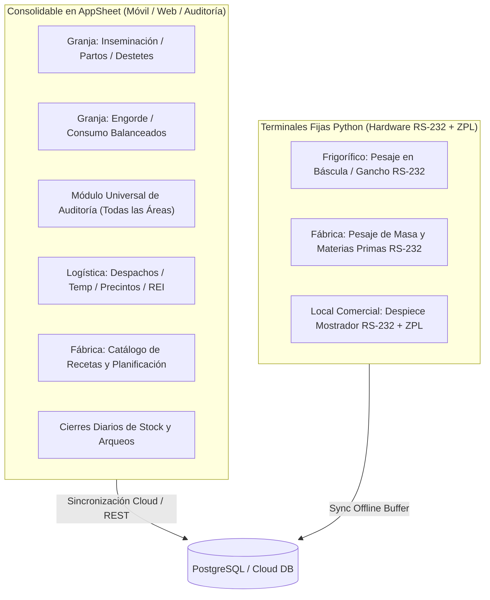
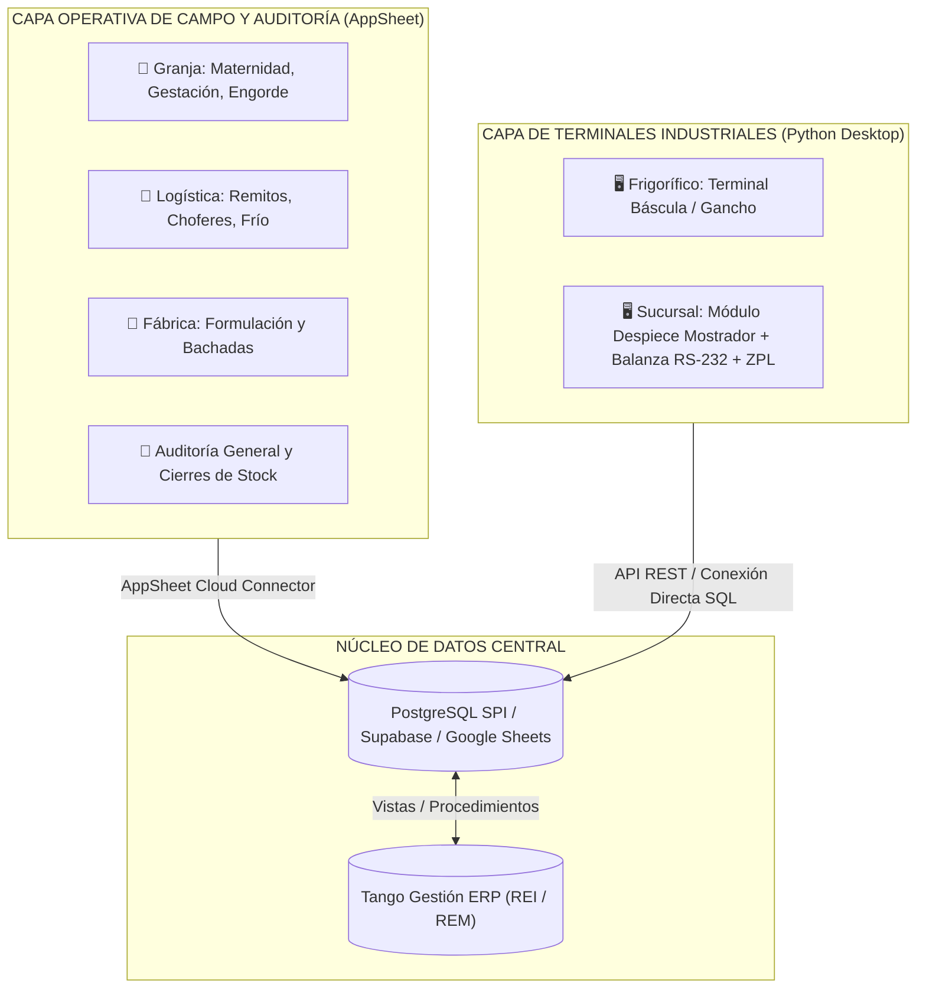
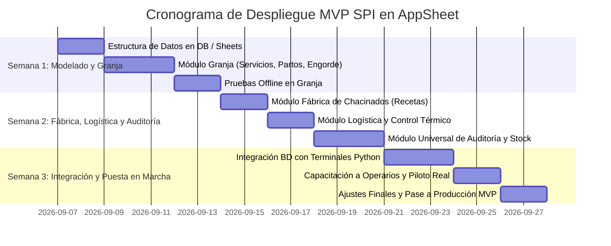

# VIABILIDAD DE APPSHEET PARA MVP - SISTEMA DE PRODUCCIÓN INTEGRAL (SPI)
**Análisis Técnico, Funcional y Estratégico de Consolidación Rápida**  
*Fecha: Septiembre 2026*  
*Basado en: `Primeros_Requerimientos_Enriquecido.md` y `Base_de_programación.md`*

---

## 1. RESUMEN EJECUTIVO

El objetivo de este análisis es determinar **cuánto del alcance total del Sistema de Producción Integral (SPI)** puede ser consolidado de forma rápida, robusta y económica en un **Producto Mínimo Viable (MVP)** utilizando la plataforma No-Code/Low-Code **Google AppSheet**, en comparación con el desarrollo nativo planificado (Android Studio en Kotlin + Python CustomTkinter).

### Conclusión General del Estudio
* **Consolidación Factible en AppSheet para MVP:** **~68% - 72% del sistema global**.
* **Eslabones con Viabilidad Óptima (85% - 100%):** Granja Porcina (Reproducción, Maternidad, Engorde), Módulo Universal de Auditorías, Logística de Frío / Despachos y Catálogos Maestros.
* **Eslabones con Viabilidad Media (70% - 80%):** Fábrica de Chacinados (Gestión de recetas y registro de bachadas digitadas) y Cierres Diarios de Stock en Sucursales.
* **Cuello de Botella Crítico (Viabilidad Baja < 40%):** Estaciones operativas con **hardware industrial directo** (lectura en tiempo real de balanzas serie RS-232 con latencia < 50ms e impresión térmica ZPL/EPL offline de etiquetas de mostrador).

> [!TIP]
> **Recomendación Estratégica:** Adoptar una **Arquitectura Híbrida para el MVP**. Utilizar **AppSheet como Core Operativo Móvil** (Granja, Auditorías, Logística y Fábrica) conectado a la base central PostgreSQL/Google Sheets, mientras se mantiene el cliente ligero en **Python exclusivamente para las terminales de balanza/etiquetado en locales y faena**. Esto reduce el tiempo de desarrollo de **4 meses a solo 3 semanas**.

---

## 2. MATRIZ DE COBERTURA Y VIABILIDAD FUNCIONAL POR ESLABÓN

| Eslabón / Módulo | Nivel de Viabilidad en AppSheet | % Cobertura MVP | Justificación Técnica y Operativa |
|---|:---:|:---:|---|
| **1. Catálogos y Operarios** | 🟢 **TOTAL** | **100%** | Manejo nativo de maestros (artículos, operarios, sucursales, PINs, precios). |
| **2. Granja: Reproducción y Partos** | 🟢 **TOTAL** | **95%** | Formularios dinámicos, validación de celo/parto, cálculo de fechas probables y DNP en cliente. |
| **3. Granja: Destete, Recría y Engorde** | 🟢 **TOTAL** | **90%** | Agrupación de lotes, registro de balanceado, cálculo de CAF/GDP y alertas de mortandad. |
| **4. Frigorífico / Faena (Gestión y Control)** | 🟡 **PARCIAL** | **60%** | Excelente para carga de tropas, DT-e, decomisos y tipificación veterinaria; inviable para captura directa por gancho serial. |
| **5. Fábrica de Chacinados** | 🟡 **HÍBRIDA (75%)** | **75%** | Gestión de recetas y supervisión en AppSheet; pesaje de batea y masa requiere terminal Python por balanza RS-232. |
| **6. Logística y Cadena de Frío** | 🟢 **TOTAL** | **95%** | Remitos REI, firma digital de chofer, fotos de precintos, control térmico con geolocalización y mermas. |
| **7. Local Comercial: Despiece de Mostrador** | 🔴 **BAJA** | **35%** | AppSheet no puede conectarse al puerto serie RS-232 de la balanza de mostrador ni disparar impresión ZPL sin conexión. |
| **8. Local Comercial: Auditoría Diaria Stock** | 🟢 **TOTAL** | **95%** | Reconciliación de stock teórico vs físico, fotos de control de batea y cálculo de desvíos ($\Delta$). |
| **9. Auditoría Universal Multi-Área** | 🟢 **TOTAL** | **100%** | Checklists parametrizables, firmas, evidencias fotográficas, cálculo de puntaje y reportes PDF automáticos. |
| **10. Trazabilidad M:N (Event Log)** | 🟡 **MEDIA-ALTA** | **75%** | Inserción inmutable de eventos (`evento_lote`). La visualización de árbol genealógico complejo requiere vista complementaria. |

---

## 3. ANÁLISIS DETALLADO POR ESLABÓN PRODUCTIVO



---

### 3.1 Eslabón 1: Granja Porcina (Reproducción, Maternidad, Engorde)
* **Viabilidad:** **95% (Excelente)**.
* **Módulos implementables en AppSheet:**
  - **Servicios e Inseminación:** Registro de cerda (caravana escaneable por cámara/código), macho/dosis, operario y cálculo automático de fecha probable de ecografía (+21 días) y parto (+114 días).
  - **Diagnóstico y Partos:** Carga de lechones vivos, muertos, momias, adopciones/donaciones y cálculo del total de camada efectiva.
  - **Destetes y Lotes:** Generación del `lote_destete` automático, pesaje global de camada y asignación a galpón.
  - **Recría y Engorde (M:N):** Formulario maestro-detalle para componer lotes de engorde a partir de múltiples destetes. Registro de entregas de alimento balanceado.
* **Cálculo de KPIs en AppSheet:**
  - Tasa de concepción, Días No Productivos (DNP), Mortandad pre-destete y en engorde, Ganancia Diaria de Peso (GDP) mediante expresiones virtuales (`SUM`, `AVERAGE`, `COUNT`).
* **Modo Offline:** Nativo en AppSheet. El operario recorre los galpones sin cobertura WiFi/4G, registra los eventos y la app sincroniza al regresar a la oficina.

---

### 3.2 Eslabón 2: Frigorífico y Faena
* **Viabilidad:** **60% (Gestión Sí, Automatización No)**.
* **Lo que SÍ resuelve AppSheet:**
  - Ingreso de tropa con DT-e de SENASA, número de cabezas, horas de descanso y peso de despacho vs peso en báscula.
  - Dictamen veterinario SENASA (Aprobado, Decomiso parcial, Decomiso total).
  - Registro manual de medias reses (gancho frío, espesor de grasa dorsal en mm, % magro y pH).
  - Auditoría de rendimientos de faena (%) y mermas de oreado.
* **Lo que NO resuelve AppSheet:**
  - Captura automática en línea de faena continua (pesaje al gancho a velocidad de noria con básculas industriales seriales/Ethernet).

---

### 3.3 Eslabón 3: Fábrica de Chacinados
* **Viabilidad Global:** **75% (Híbrida: Supervisión en AppSheet + Pesaje en Python)**.
* **Componente Móvil / Gestión en AppSheet (Fácil y rápido):**
  - **Catálogo de Recetas:** Tablas de formulación estándar (Chorizo, Salame, Bondiola, Jamón Cocido) con porcentajes teóricos de ingredientes.
  - **Planificación de Bachadas:** Al seleccionar una receta y los kilos a elaborar, AppSheet calcula la cantidad requerida de magro, tocino (Lote fijo `00049`), tripas y aditivos/sales de cura.
  - **Control de Secado y Mermas:** Registro de pesajes de control en estufa/secadero y cálculo de merma ($35\% - 38\%$).
* **Componente de Pesaje Físico en Fábrica (Requiere Terminal Python RS-232):**
  - Al igual que en locales y frigorífico, el pesaje exacto de batea, cortes y grasas en las balanzas industriales fijas conectadas por RS-232 se realiza mediante la misma terminal ligera Python para garantizar latencia cero y precisión sin errores humanos de tipeo. Ambos componentes comparten la tabla `chacinados_bachadas`.

---

### 3.4 Eslabón 4: Logística y Transporte Térmico
* **Viabilidad:** **95% (Casi Total)**.
* **Funcionalidades en AppSheet:**
  - **Despacho:** Creación del remito digital Tango REI, asignación de chofer, patente del camión y precintos de seguridad.
  - **Control de Cadena de Frío:** Captura de temperatura en salida y llegada. Si $\text{Temp} > 4.0\text{ °C}$, la app dispara una alerta visual y requiere justificación obligatoria.
  - **Recepción en Sucursal:** El encargado del local recibe el remito en su tablet/móvil, cuenta piezas, pesa y valida diferencias de transporte (alerta si merma $> 0.5\%$).
  - **Firma y Fotos:** Captura de firma digital del chofer y fotos del precinto o estado de la mercadería.

---

### 3.5 Eslabón 5: Locales Comerciales y Despiece SPI
* **Viabilidad Operativa Mostrador:** **35% (Crítico)**.
* **Viabilidad Gestión/Auditoría Local:** **90%**.
* **El Reto Técnico del Mostrador:**
  - En la carnicería, el carnicero realiza despieces continuos de Jamones, Paletas y Costillares. Requiere pesar en una balanza conectada por cable serial RS-232 y que el sistema tome el peso en **menos de 50 milisegundos**, genere el lote y mande a imprimir una etiqueta adhesiva con código de barras en una impresora térmica ZPL (Zebra/TSC).
  - **Limitación de AppSheet:** No posee drivers de puerto COM local ni capacidad de impresión térmica directa sin conexión a la nube.
* **Solución de Compromiso en AppSheet (Si se quisiera usar 100% AppSheet):**
  - El carnicero mira el visor de la balanza física y digita el peso manualmente en el formulario de AppSheet.
  - AppSheet genera el lote según la fórmula anti-colisión ($\mathbf{D} + \mathbf{WW} + \mathbf{YY} + \text{—} + \mathbf{L4} + \text{—} + \mathbf{SS} + \mathbf{SUF}$) y muestra un código de barras en pantalla o genera un PDF para imprimir en impresora estándar.
  - *Veredicto:* Válido para probar el MVP con bajo volumen, pero **inviable para ritmo operativo real de mostrador** (donde se recomienda mantener el software Python existente).

---

### 3.6 Eslabón 6: Módulo Universal de Auditoría y Control de Stock
* **Viabilidad:** **100% (Perfecto Ajuste)**.
* **Funcionalidades en AppSheet:**
  - **Checklists Dinámicos:** Módulo transversal aplicable a Granja (bioseguridad), Frigorífico (higiene/HACCP), Fábrica (BPM) y Locales (auditoría de batea/cámara).
  - **Cierre Diario de Stock de Sucursal:**
    - Carga del stock físico real al final del día.
    - Cruce contra ingresos (REI), ventas (REM) y salidas por despiece.
    - Cálculo automático del desvío $\Delta = \text{Stock Físico} - \text{Stock Teórico}$.
    - Clasificación automática: `NORMAL`, `FALTANTE_LEVE`, `FALTANTE_GRAVE` ($> 2.0\text{ kg}$) o `SOBRANTE`.
  - **Generación de Reportes:** Envío automático de resumen PDF por correo al auditor general y gerencia ante desvíos críticos.

---

### 3.7 Eslabón 7: Trazabilidad Global y Event Log Inmutable
* **Viabilidad:** **75%**.
* **Comportamiento en AppSheet:**
  - Cada acción (Parto, Movimiento, Elaboración, Despacho, Decomiso) crea un registro en la tabla `evento_lote`.
  - Mediante permisos de tabla (`Adds only`, sin `Updates` ni `Deletes`), AppSheet garantiza el comportamiento inmutable de auditoría.
  - **Búsqueda hacia atrás (Upstream Traceability):** Un usuario puede escanear o tipear un lote de salame o corte de mostrador y AppSheet despliega los registros relacionados (Lote madre $\rightarrow$ Tropa $\rightarrow$ Lote Engorde $\rightarrow$ Destete $\rightarrow$ Cerda).

---

## 4. ANÁLISIS DE FACTIBILIDAD TÉCNICA OFFLINE-FIRST

AppSheet cuenta con un motor offline nativo que se alinea estrechamente con los requerimientos del sector agropecuario:

```mermaid
sequenceDiagram
    participant Op as Operario (Granja/Local)
    participant AS as AppSheet Client (Móvil/Tablet)
    participant Cache as Almacenamiento Local (IndexedDB/SQLite)
    participant Server as AppSheet Cloud Engine
    participant DB as Base Central (PostgreSQL / Google Sheets)

    Op->>AS: Ingresa Parto / Servicio / Auditoría
    AS->>Cache: Guarda transacción en cola local (Offline)
    AS-->>Op: Confirmación inmediata en pantalla (< 100ms)
    Note over AS,Cache: Operario continúa trabajando sin internet
    
    When Conexión Detectada:
    AS->>Server: Envía lote de cambios pendientes (Sync)
    Server->>DB: Inserción transaccional idempotente
    Server-->>AS: Confirmación de sincronización exitosa
```

### Fortalezas de AppSheet Offline:
1. **Zero-Configuración de Base de Datos Local:** No requiere programar migraciones SQLite ni implementar Room/Retrofit manualmente.
2. **Cola de Encolado Asíncrona:** Las acciones se almacenan localmente y se transmiten automáticamente cuando el dispositivo recupera señal.
3. **Imágenes y Firmas Offline:** Las fotos de auditoría y firmas de chofer se guardan en el dispositivo y se transfieren en background.

### Limitaciones Offline a Considerar:
1. **Bloqueo de Claves Únicas en Desconexión:** Si dos operarios en distintas tablets intentan generar exactamente el mismo código simultáneamente sin internet, puede haber colisión al sincronizar (se mitiga usando `UNIQUEID()` como clave primaria técnica).
2. **Latencia de Sincronización:** La sincronización no es en tiempo real milisegundo a milisegundo; toma entre 2 y 10 segundos al reconectar.

---

## 5. COMPARATIVA ESTRATÉGICA: APPSHEET MVP vs. DESARROLLO A MEDIDA

| Dimensión de Evaluación | Opción A: Desarrollo a Medida (Android Kotlin + Python) | Opción B: MVP 100% AppSheet | Opción C: Arquitectura Híbrida Recomendada (AppSheet + Python Edge) |
|---|---|---|---|
| **Tiempo de Desarrollo (Time to Market)** | 12 a 16 semanas (3 - 4 meses) | **1 a 2 semanas** | **2 a 3 semanas** |
| **Costo Inicial de Desarrollo** | Alto (Desarrolladores Android, Backend, QA) | Muy Bajo (Configuración No-Code) | Bajo (Aprovecha scripts existentes) |
| **Integración con Balanzas RS-232** | Nativa y en tiempo real (< 50ms) | No soportada (Carga manual de peso) | **Nativa en mostrador con Python** |
| **Impresión Térmica ZPL Offline** | Nativa directa por USB/Serie | Compleja / Requiere drivers cloud | **Nativa directa con Python** |
| **Mantenimiento y Flexibilidad** | Requiere recompilar APKs y redesplegar | Modificaciones en minutos desde navegador | Modificaciones instantáneas en móvil; Python estable |
| **Experiencia en Granja y Campo** | Excelente (App dedicada) | Excelente (UI móvil fluida y limpia) | Excelente (AppSheet en tablets/celulares) |
| **Riesgo de Proyecto** | Alto (Riesgo de desvío en plazos) | Bajo (Validación inmediata de procesos) | **Mínimo (Mejor balance funcional)** |

---

## 6. ARQUITECTURA HÍBRIDA RECOMENDADA PARA EL MVP

Para obtener **el 100% de la funcionalidad operativa real en tiempo récord**, la arquitectura recomendada combina lo mejor de ambos mundos:



### Roles de la Arquitectura Híbrida:
1. **Google AppSheet:**
   - Cubre todos los procesos móviles, inspecciones en campo, auditorías, logística, producción de chacinados y tableros de control.
   - Utilizado por: Veterinarios, operarios de granja, choferes, maestros fiambreros, auditores y gerencia.
2. **Python Desktop (Terminales Fijas):**
   - Se mantiene exclusivamente en los puntos donde hay **balanza física conectada por cable** e **impresora de etiquetas térmicas** (Despiece en carnicería y Báscula de faena).
   - Utilizado por: Carniceros de local y pesadores de frigorífico.
3. **Base de Datos Unificada (PostgreSQL / Google Sheets):**
   - Ambos sistemas leen y escriben sobre las mismas tablas (`spi_despiece_sesiones`, `evento_lote`, `auditoria_stock_cierres_diarios`, etc.), garantizando trazabilidad unificada.

---

## 7. PLAN DE IMPLEMENTACIÓN Y CRONOGRAMA DEL MVP (3 SEMANAS)



### Entregables Clave:
* **Semana 1:** App móvil para Granja operativa con captura offline de servicios, partos, destetes y consumos.
* **Semana 2:** Módulos de Fábrica, Logística y Cierres Diarios de Sucursales funcionando en AppSheet con alertas de desvío y generación de PDF.
* **Semana 3:** Terminales de despiece en Python conectadas a la misma base de datos y sistema integral en marcha en sucursales y granja piloto.

---

## 8. CONCLUSIONES Y RECOMENDACIÓN FINAL

1. **Alta Rentabilidad Técnica de AppSheet:** Construir el MVP en AppSheet permite **ahorrar más del 70% del tiempo de desarrollo inicial**, permitiendo a la empresa digitalizar inmediatamente la Granja, la Logística, la Fábrica y las Auditorías sin esperar meses de programación tradicional.
2. **Validación Temprana del Negocio:** Permite verificar en la práctica los KPIs, las fórmulas de merma y el comportamiento de los operarios antes de realizar inversiones mayores en desarrollo de software a medida.
3. **Evolución Natural:** Si en el futuro el volumen operativo o requerimientos específicos de la Granja superan a AppSheet, se podrá migrar ese módulo a Android Studio (siguiendo la `Base_de_programación.md`) sin alterar el modelo de datos ni la lógica de negocio ya consolidada.
