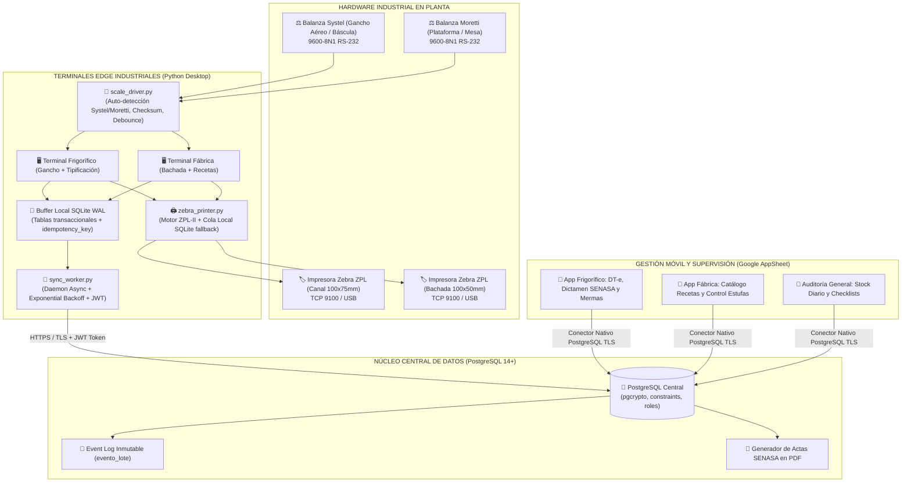
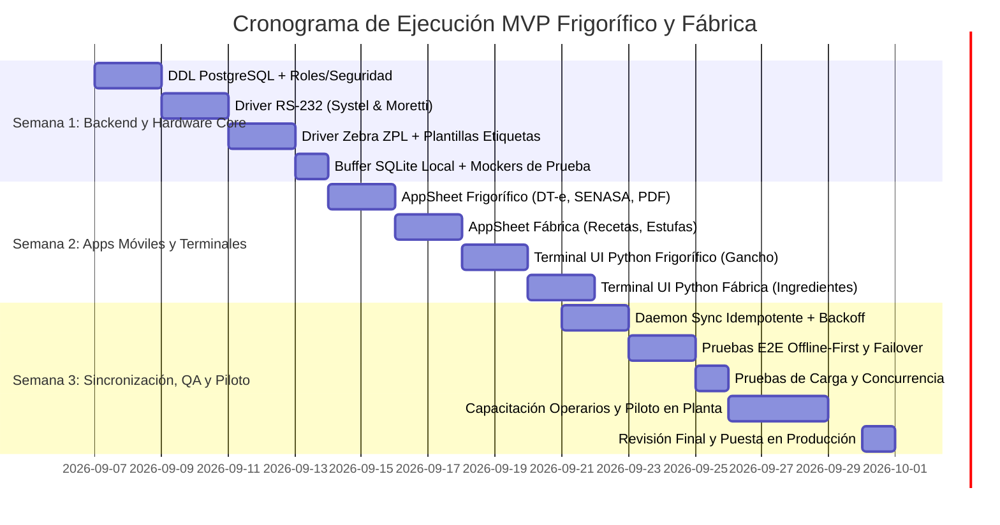

# PLAN DE IMPLEMENTACIÓN DEFINITIVO: MVP FRIGORÍFICO Y FÁBRICA
**Sistema de Producción Integral (SPI)**  
*Hardware: Balanzas Systel & Moretti (RS-232) + Impresoras Térmicas Zebra (ZPL-II)*  
*Software: Google AppSheet (Gestión/Inspección Móvil) + Python Desktop (Terminales Edge) + PostgreSQL Central*  
*Versión: 2.0 (Auditada y Aprobada para Construcción)*  
*Fecha de Emisión: Septiembre 2026*

---

## 1. DESCRIPCIÓN DEL OBJETIVO

Construir y poner en marcha en **3 semanas** el **MVP productivo de Frigorífico (Faena) y Fábrica de Chacinados**, integrando captura automática de pesaje desde balanzas **Systel y Moretti**, emisión instantánea de etiquetas en impresoras térmicas **Zebra (ZPL-II)**, gestión y dictamen veterinario en tablets mediante **AppSheet**, operación 100% offline-first con SQLite local y sincronización transaccional idempotente con una base de datos central **PostgreSQL**.

### Criterios de Éxito del MVP:
1. **Registro completo de tropa:** Carga de DT-e, inspección sanitaria SENASA, pesaje al gancho caliente y tipificación con emisión de etiqueta ZPL en tiempo real.
2. **Generación automática de actas:** Emisión en PDF de actas de decomiso y resúmenes de rendimiento de faena.
3. **Control de bachada en fábrica:** Selección de receta, pesaje asistido de magro, tocino (Lote fijo `00049`) y especias, con emisión de etiqueta de trazabilidad.
4. **Resiliencia Offline-First:** Si se corta la red o internet en planta, el operario sigue pesando e imprimiendo normalmente en su buffer SQLite local, sincronizando automáticamente al reconectar sin duplicar registros.

---

## 2. ARQUITECTURA TÉCNICA Y SEGURIDAD



### Directivas de Seguridad y Resiliencia:
* **Roles y Permisos de Base de Datos:**
  - `app_user`: Lectura y escritura operacional desde AppSheet. Revocado el permiso `DELETE` para evitar pérdidas accidentales.
  - `edge_user`: Acceso restringido para terminales Python (inserciones operacionales e inserción en `evento_lote`).
  - `audit_user`: Acceso a vistas gerenciales y cierres de stock diarios.
* **Cifrado y Comunicación:** Todo el tráfico transaccional viaja cifrado bajo TLS 1.2+. Las credenciales se almacenan en variables de entorno seguras (`.env`), nunca en el código fuente.
* **Idempotencia Garantizada:** Cada pesaje y evento genera un `idempotency_key` único (UUIDv4 / Hash de timestamp + operario + equipo). Si la red se reconecta y reenvía el lote, PostgreSQL ejecuta `ON CONFLICT (idempotency_key) DO NOTHING`, evitando duplicaciones.

---

## 3. ESPECIFICACIÓN TÉCNICA DE HARDWARE E INTEGRACIONES

### 3.1 Driver de Balanzas RS-232 (`scale_driver.py`)
* **Protocolo Systel (Cuora / Croma / Urbe / Indicadores de Gancho):**
  - Trama continua estándar: `[STX][STATUS][SIGNO][PESO 6 DÍGITOS][TARA 6 DÍGITOS][ETX]`.
  - Configuración: 9600 bps, 8N1, sin handshaking físico.
  - Filtro de debounce: Mínimo 3 lecturas idénticas consecutivas para certificar peso estable antes de captura.
* **Protocolo Moretti (Dibal / LAP / Cenith / Básculas de Plataforma):**
  - Trama ASCII continua o por polling (`ENQ`): `[STX]P+000.000kg[ETX]`.
  - Configuración: 9600 / 4800 bps, 8N1.
* **Tolerancia y Reconexión:** El driver corre en un hilo daemon con timeout de 1s. Si se desconecta el cable USB-Serie, entra en modo de auto-reconexión cíclica cada 2 segundos sin congelar la interfaz gráfica.

### 3.2 Driver e Impresión Zebra ZPL (`zebra_printer.py`)
* **Etiqueta 1: Media Res / Canal (Frigorífico):**
  - Dimensiones: $100\text{ mm} \times 75\text{ mm}$ (Térmica industrial adhesiva).
  - Campos obligatorios: Código Lote Media Res, Tropa DT-e, Lado (IZQ/DER), Kilos Gancho Caliente, Espesor Grasa (mm), % Magro estimado, Fecha/Hora, Código Code-128 legible con pistola y Código QR de trazabilidad web.
* **Etiqueta 2: Bachada de Chacinados (Fábrica):**
  - Dimensiones: $100\text{ mm} \times 50\text{ mm}$.
  - Campos obligatorios: Lote Bachada, Código Receta Tango, Nombre Producto, Kilos Formulados, Unidades/Ristras, Lote Tocino (`00049`), Fecha de Elaboración y Código de Barras Code-128.
* **Cola de Impresión Local Fallback:** Si la impresora Zebra está apagada o sin papel, las tramas ZPL se guardan en la tabla SQLite `pending_labels`. Al restablecer la conexión TCP/USB, se vacía la cola automáticamente.

---

## 4. ESTRUCTURA DEL REPOSITORIO Y COMPONENTES

```
📦 SPI_MVP_FRIGORIFICO_FABRICA/
├── 📁 database/
│   ├── 01_init_schema_postgres.sql       # DDL v2.0 completo con roles, constraints y pgcrypto
│   ├── 02_seed_catalogs.sql              # Catálogos maestros (operarios, artículos, recetas)
│   └── 03_views_and_kpis.sql             # Vistas analíticas para AppSheet (mermas, rendimientos)
├── 📁 appsheet_blueprints/
│   ├── frigorifico_app_spec.md           # Slices, UX Views y tablas para Faena
│   ├── fabrica_app_spec.md               # Formularios de bachadas, ingredientes y estufas
│   └── pdf_templates/
│       ├── acta_decomiso_senasa.html     # Plantilla para actas veterinarias
│       └── etiqueta_media_res_zpl.txt    # Plantilla ZPL parametrizada
├── 📁 python_edge/
│   ├── hardware/
│   │   ├── scale_driver.py               # Driver multi-protocolo Systel y Moretti
│   │   └── zebra_printer.py              # Motor ZPL-II con cola de fallback SQLite
│   ├── terminal_frigorifico.py           # GUI de planta: Pesaje gancho + Tipificación + ZPL
│   ├── terminal_fabrica.py               # GUI de planta: Pesaje de ingredientes + Bachadas
│   ├── local_db.py                       # Buffer local SQLite (WAL mode)
│   └── sync_worker.py                    # Demonio de sincronización idempotente hacia PostgreSQL
├── 📁 tests_and_simulation/
│   ├── mock_scale_systel_moretti.py      # Emulador de balanza por puerto COM virtual
│   ├── mock_zebra_server.py              # Receptor mock de tramas ZPL (preview gráfico)
│   └── test_traceability_e2e.py          # Test integral: Tropa -> Media Res -> Bachada
└── 📁 docs/
    ├── risk_matrix.md                    # Matriz de riesgos y mitigaciones
    └── training_material/
        ├── operador_frigorifico.pdf
        └── operador_fabrica.pdf
```

---

## 5. CRONOGRAMA DE EJECUCIÓN (GANTT DE 3 SEMANAS)



### Hitos de Entrega y Criterios de Aceptación:
| Hito | Fecha | Entregable | Criterio de Aceptación Formal |
|:---:|:---:|---|---|
| **H1** | Fin Sem. 1 | Esquema PostgreSQL desplegado con roles y extensiones. | Tablas creadas, constraints validados y permisos verificados con `psql`. |
| **H2** | Fin Sem. 1 | Drivers RS-232 y ZPL operativos con emuladores. | Lectura de peso en $< 50\text{ ms}$, filtrado de ruido OK y etiquetas ZPL legibles. |
| **H3** | Mitad Sem. 2 | Aplicaciones AppSheet conectadas a PostgreSQL. | Carga de tropa y recetas desde móvil sin errores, generación de actas PDF. |
| **H4** | Fin Sem. 2 | Terminales táctiles de planta operativas. | UI acorde a `Visual del programa.md`, operables con guantes (botones $\ge 54\text{ px}$). |
| **H5** | Mitad Sem. 3 | Demonio de sincronización validado. | 100 eventos offline sincronizados tras reconexión sin pérdida ni duplicación. |
| **H6** | Fin Sem. 3 | Piloto real completado en frigorífico y fábrica. | Registro de 5 tropas y 2 bachadas reales con trazabilidad 100% auditable. |

---

## 6. PLAN DE VERIFICACIÓN Y CONTROL DE CALIDAD (QA)

| Tipo de Prueba | Herramienta / Método | Criterio de Éxito |
|---|---|---|
| **Unit Tests – Driver Systel** | `pytest` + emulador de trama continua `STX...ETX` | $\ge 95\%$ pruebas aprobadas, tolerancia de ruido $<\pm 0.01\text{ kg}$. |
| **Unit Tests – Driver Moretti** | `pytest` + emulador ASCII por polling | Detección exacta de signo, tara y peso neto. |
| **Unit Tests – Impresión Zebra** | Socket TCP + Mock ZPL Viewer | Código de barras Code-128 y QR legibles con lector óptico móvil. |
| **Integración – Sync Worker** | Simulación de corte de red durante pesajes masivos | Buffer SQLite almacena en WAL; sincronización completa en $\le 5\text{ s}$ al reconectar. |
| **E2E – Trazabilidad Completa** | `test_traceability_e2e.py` | Consulta ascendente desde Lote de Salame hasta Tropa de origen en `evento_lote`. |
| **Pruebas de Carga** | `locust` (100 pesadas concurrentes + 30 usuarios AppSheet) | Latencia media $< 200\text{ ms}$, 0 errores de servidor 5xx. |
| **Pruebas de Recuperación** | Apagado intempestivo de terminal de pesaje | Al encender el equipo, no hay corrupción de SQLite ni registros truncados. |

---

## 7. MATRIZ DE RIESGOS Y MITIGACIONES

| Riesgo Identificado | Probabilidad | Impacto | Estrategia de Mitigación |
|---|:---:|:---:|---|
| **Desconexión o falso contacto de cable RS-232** | Media | Alto | Auto-reconexión cíclica en `scale_driver.py` con alerta visual en pantalla. |
| **Impresora Zebra sin insumo o desconectada** | Media | Medio | Cola de impresión en SQLite (`pending_labels`) y botón de re-impresión en UI. |
| **Pérdida de conectividad a internet en planta** | Alta | Medio | Operación 100% offline-first; no requiere internet para pesar ni etiquetar. |
| **Colisión de claves al sincronizar lotes** | Baja | Alto | Claves primarias generadas con UUIDv4 e `idempotency_key` único por evento. |
| **Resistencia al cambio de operarios de planta** | Media | Medio | Interfaces táctiles ultra-simples, botones gigantes y capacitación de 2h en puesto. |

---

*Este documento unificado constituye la hoja de ruta técnica oficial y definitiva para el desarrollo del MVP de Frigorífico y Fábrica del SPI.*
