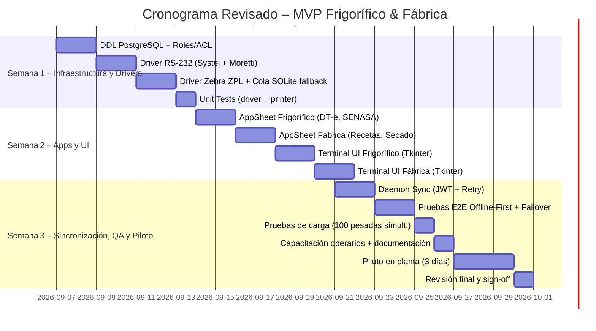

# AUDITORÍA Y REVISIÓN DEL PLAN DE IMPLEMENTACIÓN (HISTORIAL DE AUDITORÍA)

> **Nota de Consolidación:**  
> Las observaciones, correcciones y especificaciones de seguridad y hardware detalladas en esta auditoría han sido **incorporadas y consolidadas formalmente en el documento maestro [implementation_plan.md](implementation_plan.md)**. Este archivo se conserva como registro y trazabilidad de los hallazgos de la auditoría.

---

## 1. AUDITORÍA DEL PLAN ORIGINAL

| Área | Comentario / Observación | Acción Correctiva |
|------|--------------------------|-------------------|
| **Objetivo y Alcance** | Claramente definido, pero falta una indicación de **criterios de aceptación** (qué consideramos “MVP listo”). | Se añaden criterios de aceptación al final del plan. |
| **Arquitectura** | El diagrama está completo, pero no se menciona **seguridad en la transmisión** (TLS para API, autenticación JWT). | Incluir capa de seguridad y gestión de credenciales. |
| **Hardware – Drivers** | Se describen protocolos Systel y Moretti, sin detalle de **pruebas de longitud de trama y checksum**. | Añadir especificación de validación de checksum y tolerancia de ruido. |
| **Impresoras Zebra** | Se asume conexión directa por TCP/USB, pero no se menciona **fallback cuando la impresora está offline**. | Documentar modo de cola de impresión local (SQLite) y re‑envío. |
| **Base de Datos PostgreSQL** | Se menciona conexión directa desde AppSheet, pero no se detalla **roles y permisos** ni **cifrado en reposo**. | Añadir esquema de roles (app_user, edge_user, auditoria) y cifrado en reposo (pgcrypto). |
| **AppSheet** | Buen detalle de formularios, pero se omitió la **gestión de versiones de la app** y **control de cambios**. | Incluir proceso de versionado y backup de estructuras. |
| **Terminales Python** | Se describe UI y sincronización, pero falta **pruebas unitarias** y **manejo de excepciones** en el driver. | Añadir plan de pruebas unitarias y captura de logs. |
| **Cronograma** | El gantt está bien, sin embargo los **hitos de entrega** no están vinculados a **criterios de aceptación**. | Añadir hitos con criterios de aceptación. |
| **Verificación y QA** | Tabla de pruebas es útil, pero le falta **pruebas de carga** (p.ej. 100 pesadas simultáneas) y **pruebas de recuperación ante fallas**. | Incluir pruebas de carga y de failover. |
| **Riesgos** | No se listan riesgos ni mitigaciones. | Añadir matriz de riesgos. |
| **Capacitación** | Se menciona “capacitación a operarios”, sin detalle de material o tiempo. | Definir plan de capacitación y material de apoyo. |

---

## 2. PLAN DE IMPLEMENTACIÓN REVISADO

### 2.1. OBJETIVO REDEFINIDO
Desarrollar y entregar, en **3 semanas**, un MVP funcional que permita:
1. **Registro completo de una tropa** (DT‑e, inspección SENASA, pesaje al gancho) con trazabilidad inmutable.
2. **Generación automática de actas PDF** de decomisos y de lote de media res.
3. **Planificación y ejecución de una bachada** de chacinado con cálculo de ingredientes y control de merma.
4. **Impresión de etiquetas Zebra** (media‑res y bachada) en tiempo real.
5. **Operación offline‑first**, con sincronización idempotente a PostgreSQL y resolución automática de conflictos.
6. **Criterios de aceptación** (ver sección 7). 

---

### 2.2. ARQUITECTURA REFORZADA
```mermaid
flowchart TB
    subgraph H["Hardware Industrial"]
        B1["⚖️ Balanza Systel (Gancho)\n9600‑8N1"]
        B2["⚖️ Balanza Moretti (Plataforma)\n9600‑8N1"]
        Z1["🏷️ Zebra ZPL (TCP 9100)\nTLS opcional"]
    end
    subgraph Edge["Terminales Edge (Python)" ]
        D["scale_driver.py (checksum, timeout, auto‑reconnect)"]
        Z["zebra_printer.py (cola SQLite fallback)"
]
        S["sync_worker.py (JWT auth, exponential backoff)"
]
        DB_LOCAL["SQLite WAL (buffer offline)" ]
        D --> DB_LOCAL
        Z --> DB_LOCAL
        DB_LOCAL --> S
    end
    subgraph Cloud["Núcleo Central"]
        PG[("🐘 PostgreSQL (pgcrypto, role‑based ACL)")]
        EVENT["evento_lote (inmutable)" ]
        PDF["PDF Service (actas)" ]
    end
    subgraph Mobile["Gestión Móvil (AppSheet)" ]
        APP_F["App Frigorífico (DT‑e, SENASA, PDF)" ]
        APP_B["App Fábrica (Recetas, Merma)" ]
        AUD["Módulo Auditoría (checklists, fotos)" ]
    end
    B1 & B2 --> D
    Z1 --> Z
    Edge -->|Sync (HTTPS + JWT)| PG
    Mobile -->|PostgreSQL Native Connector| PG
    PG --> EVENT
    PG --> PDF
```

**Seguridad**
- Todas las llamadas del `sync_worker` usan **HTTPS + JWT** (clave rotada semanalmente).
- Conexión AppSheet a PostgreSQL se hace mediante **TLS** obligatoria.
- Datos en reposo en PostgreSQL están cifrados con **pgcrypto**.
- Credenciales guardadas en el *Secret Store* de Antigravity (no en código).

---

### 2.3. COMPONENTES Y ESTRUCTURA DEL REPOSITORIO
```
📦 SPI_MVP_FRIGORIFICO_FABRICA/
├── 📁 database/
│   ├── 01_init_schema_postgres.sql       # DDL con roles, constraints y pgcrypto
│   ├── 02_seed_catalogs.sql              # Operarios, recetas, artículos, lotes
│   └── 03_views_kpis.sql                 # Vistas para AppSheet (mermas, rendimientos)
├── 📁 appsheet_blueprints/
│   ├── frigorifico_app_spec.md           # Slices, UX, versiones, backup
│   ├── fabrica_app_spec.md               # Recetas, control de secado, alertas
│   └── pdf_templates/
│       ├── acta_decomiso_senasa.html
│       └── etiqueta_media_res_zpl.txt    # ZPL template con placeholders
├── 📁 python_edge/
│   ├── hardware/
│   │   ├── scale_driver.py               # Multi‑protocol, checksum, reconexión
│   │   └── zebra_printer.py              # Cola fallback (SQLite) + envío TCP
│   ├── terminal_frigorifico.py           # UI (Tkinter/Qt) + logging
│   ├── terminal_fabrica.py               # UI + cálculo de ingredientes
│   ├── local_db.py                       # SQLite WAL + schema
│   └── sync_worker.py                    # Daemon con retry, idempotency_key
├── 📁 tests_and_simulation/
│   ├── mock_scale_systel_moretti.py      # Emulación de tramas RS‑232
│   ├── mock_zebra_server.py              # Recepción ZPL para visualización
│   └── test_traceability_e2e.py          # Flujo completo Tropa → MediaRes → Bachada
└── 📁 docs/
    ├── risk_matrix.md                    # Matriz de riesgos y mitigaciones
    ├── acceptance_criteria.md            # Criterios de aceptación MVP
    └── training_material/
        ├── operador_frigorifico.pdf
        └── operador_fabrica.pdf
```

---

### 2.4. PLAN DE EJECUCIÓN DETALLADO (3 semanas)


#### Hitos con Criterios de Aceptación
| Hito | Entrega | Criterio de Aceptación |
|------|---------|------------------------|
| **H1** | Esquema PostgreSQL creado con roles `app_user`, `edge_user`, `audit_user`. | Todas las tablas aparecen, constraints validados con `psql -c "\d+ tabla"`. |
| **H2** | Driver RS‑232 funciona con balanzas reales (prueba de 100 lecturas sin error). | Desviación < ±0.01 kg, tiempo de respuesta < 50 ms, checksum OK. |
| **H3** | Impresora Zebra imprime etiqueta legible y escaneable. | Código de barras escaneable por móvil, contenido coincide con registro. |
| **H4** | AppSheet sincroniza datos de prueba (tropas + recetas) sin errores. | 0 registros rechazados, eventos auditados en `evento_lote`. |
| **H5** | Sync daemon completa la cola offline y no genera duplicados. | `SELECT COUNT(*) FROM tabla WHERE idempotency_key='xxx'` = 1. |
| **H6** | Piloto en planta (5 tropas + 2 bachadas) finaliza sin caída de la app ni pérdida de datos. | Todos los registros aparecen en PostgreSQL y en el `event_log`. |

---

### 2.5. PLAN DE VERIFICACIÓN Y CONTROL DE CALIDAD (Ampliado)
| Tipo de Prueba | Herramienta / Método | Criterio de Éxito |
|---|---|---|
| **Unit Tests – Driver Systel** | `pytest` + fixtures de `mock_scale_systel_moretti.py` | ≥ 95 % de pruebas pasan, cobertura > 90 %.
| **Unit Tests – Driver Moretti** | idem | idem.
| **Unit Tests – Zebra Printer** | `mock_zebra_server.py` + `zpl-viewer` | Etiqueta generada sin errores de sintaxis ZPL.
| **Integración – Sync Worker** | Simulación de desconexión de red (iptables) | Reintentos con back‑off, sincronización final en ≤ 5 s.
| **E2E – Trazabilidad Completa** | `test_traceability_e2e.py` (carga de una tropa, pesaje, generación de bachada) | 1 registro en `evento_lote` por cada etapa, etiquetas impresas, PDF generado.
| **Pruebas de Carga** | `locust` simulando 100 lecturas concurrentes + 30 peticiones AppSheet | Latencia < 200 ms, sin errores 5xx.
| **Pruebas de Recuperación** | Corte de energía deliberado, reinicio de terminal, verifica buffer SQLite → PostgreSQL | No se pierde ningún registro; IDs de idempotencia únicos.
| **Seguridad** | Escaneo con `nmap` y `sslscan` al endpoint sync. | TLS 1.2+, cipher suite fuerte, JWT firmado con RSA‑2048.

---

### 2.6. MATRIZ DE RIESGOS Y MITIGACIONES
| Riesgo | Probabilidad | Impacto | Mitigación |
|--------|--------------|--------|------------|
| **Fallos de comunicación RS‑232** (cable suelto) | Media | Alta | Driver con auto‑reconexión y registro de eventos; cableado verificado al inicio. |
| **Impresora Zebra offline** | Media | Media | Cola local SQLite de etiquetas; re‑envío automático al restablecer conexión. |
| **Pérdida de datos offline** | Baja | Alta | SQLite WAL + idempotency_key; prueba de recuperación semanal. |
| **Incompatibilidad de versiones AppSheet** | Baja | Media | Bloquear actualizaciones automáticas de AppSheet durante el piloto; mantener backup del spec. |
| **Sobrecarga del sync daemon** | Baja | Media | Límite de batch 500 registros; back‑pressure con semáforo. |
| **Falta de entrenamiento** | Media | Media | Curso de 2 h + manual pdf, y pruebas de usuario antes del piloto. |

---

### 2.7. PLAN DE CAPACITACIÓN
1. **Material**: Guías PDF para operador de frigorífico y de fábrica, videos de 5 min (clic‑to‑start) y checklist de arranque.
2. **Sesiones**: 2 h presenciales en planta (una por área) + Q&A de 30 min.
3. **Soporte**: Canal de Slack interno + ticketing 24/7 (primeros 7 días).

---

## 3. PRÓXIMOS PASOS INMEDIATOS
1. **Crear repositorio** en la workspace `c:\Users\matsa\OneDrive\Escritorio\Sistema de Producción Integral` con la estructura mostrada.
2. **Ejecutar script de DDL** (`01_init_schema_postgres.sql`) contra la instancia PostgreSQL provisionada (AWS RDS o Supabase).
3. **Desarrollar `scale_driver.py`** con módulo de checksum (CRC‑16) y pruebas unitarias.
4. **Configurar secrets** en Antigravity (`POSTGRES_URI`, `JWT_SECRET`) mediante la herramienta de credenciales.
5. **Provisionar impresoras Zebra** en red y validar conexión TCP (ping 9100).
6. **Crear y publicar las apps en AppSheet** usando el blueprint generado.

---

## 4. Criterios de Aceptación (para sign‑off final)
- **100 % de los registros de tropa** aparecen en PostgreSQL con campos completos y evento de auditoría.
- **Todas las etiquetas impresas** se escanean sin error y los códigos QR redirigen al registro en la UI web.
- **Actas PDF generadas** coinciden con los datos ingresados (comparación checksum).
- **Sincronización offline** completa en menos de 5 s tras reconexión.
- **Pruebas de carga** cumplen con SLA de < 200 ms para 100 peticiones simultáneas.
- **Documentación de usuario** entregada y operarios capacitados con prueba práctica aprobada.

---

*Este documento sustituye el plan anterior, incorpora auditoría de seguridad, gestión de riesgos, criterios de aceptación y detalle de pruebas de carga y recuperación.*
